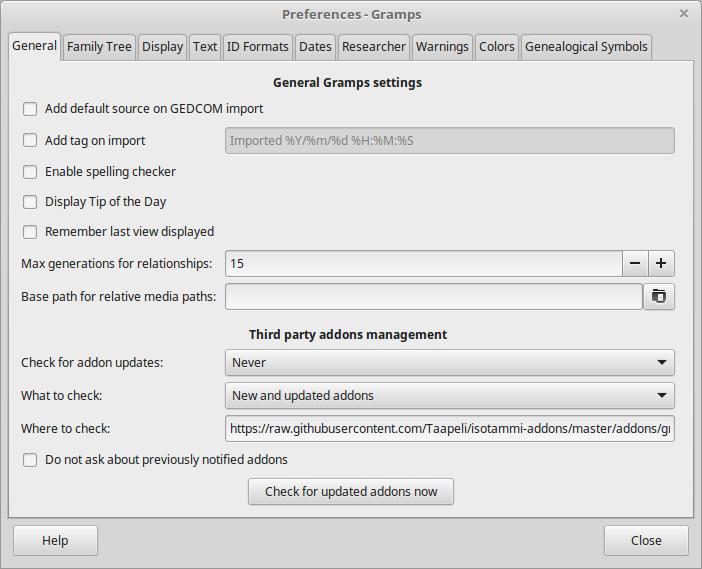
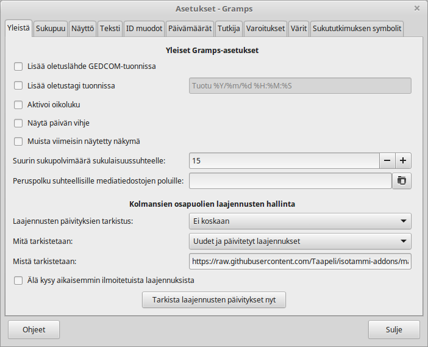

# isotammi-addons
Gramps addons for Isotammi project / Isotammen Gramps-lisäosia

To get started go to Gramps preferences (Edit > Preferences) and replace the value of "Where to check" with:

* https://raw.githubusercontent.com/Taapeli/isotammi-addons/master/addons/gramps51
(for Gramps 5.1.x)

or with

* https://raw.githubusercontent.com/Taapeli/isotammi-addons/master/addons/gramps50
(for Gramps 5.0.x)

Click "Check for updated addons now" and install all addons or at least "Select addon source".

After installation go to Gramps Dashboard and add the gramplet "Select addon source". With that you can easily select which source to use for installing addons in the future: Gramps default or Isotammi addons. 

Note that those Isotammi tools that install under the "Tools" menu will be in their own submenu "Isotammi tools".

It is recommended also to install the "Plugin Manager Enhanced"
available in the Gramps default addons as a "Plugin lib". It can be used to manage and uninstall addons.

----------------------

Isotammen lisäosat voi asentaa menemällä Grampsin asetuksiin  (Muokkaa > Asetukset) and korvaamalla kohdassa "Mistä tarkistetaan" olevan osoitteen tällä:

* https://raw.githubusercontent.com/Taapeli/isotammi-addons/master/addons/gramps51
(Gramps-versioille 5.1.x)

tai tällä:

* https://raw.githubusercontent.com/Taapeli/isotammi-addons/master/addons/gramps50
(Gramps-versioille 5.0.x)

Napsauta "Tarkista laajennusten päivitykset nyt" - saat listan Isotammen Gramps-laajennuksista. Paina "Valitse kaikki" tai valikoi ne jotka haluat asentaa (ainakin "Select addon source"). Paina "Asenna laajennukset".

Asennuksen jälkeen voit lisätä laajennuksen "Select addon source"  Grampsin työpöydälle. Sen avulla voit jatkossa helposti vaihtaa laajennusten lähteeksi joko oletuksena olevan Grampsin laajennusvaraston tai Isotammen laajennukset.

Huomaa että Työkalut-valikon alle asentuvat Isotammen Gramps-työkalut ovat omassa alavalikossaan "Isotammi-työkalut".

On suositeltavaa asentaa myös "Laajennusten parannettu hallinta",joka on Grampsin vakiolaajennusten joukossa kohdassa "Laajennuskirjasto". Sen avulla voi asennettuja laajennuksia myös helposti poistaa.

