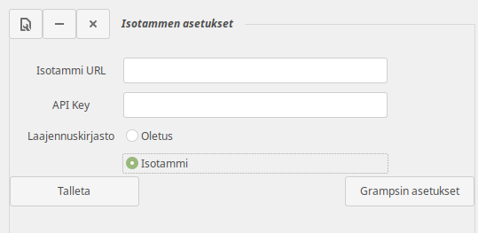
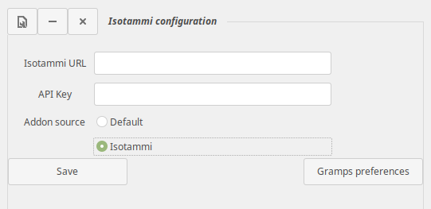

[English instructions](#isotammi-addons)

# Isotammi-lisäosat / Isotammi addons
Isotammen Gramps-lisäosia 

Isotammen lisäosat (laajennukset) voi asentaa menemällä Grampsin asetuksiin  (Muokkaa > Asetukset) and korvaamalla kohdassa "Mistä tarkistetaan" olevan osoitteen tällä:

* https://raw.githubusercontent.com/Taapeli/isotammi-addons/master/addons/gramps51
(Gramps-versioille 5.1.x)

tai tällä:

* https://raw.githubusercontent.com/Taapeli/isotammi-addons/master/addons/gramps50
(Gramps-versioille 5.0.x)

Varmista että osoitteeseen ei tule ylimääräisiä merkkejä, esim. välilyöntejä alkuun tai loppuun.

Napsauta "Tarkista laajennusten päivitykset nyt" - saat listan Isotammen Gramps-laajennuksista. Paina "Valitse kaikki" tai valikoi ne jotka haluat asentaa (ainakin "Isotammen asetukset"). Paina "Asenna laajennukset".

Asennuksen jälkeen voit lisätä laajennuksen "Isotammen asetukset" Grampsin työpöydälle. Sen avulla voit jatkossa helposti vaihtaa laajennusten lähteeksi joko oletuksena olevan Grampsin laajennusvaraston tai Isotammen laajennukset:

Valitse tässä haluttu laajennuskirjasto (Oletus tai Isotammi) ja paina "Talleta". Sen jälkeen voit avata Grampsin asetusikkunan ja ladata sieltä laajennuksia valitusta kirjastosta.

Kentät "Isotammi URL" ja "API Key" eivät ole käytössä.

Gramps-versiossa 5.2 asennus on erilainen. Lisää uusi projekti Grampsin "Addon managerin" Projects-välilehdellä ja anna sille osoitteeksi

* https://raw.githubusercontent.com/Taapeli/isotammi-addons/master/addons/gramps52

 "Isotammen asetukset" on tarpeeton versiossa 5.2 eikä sitä enää ole.

Huomaa että Työkalut-valikon alle asentuvat Isotammen Gramps-työkalut ovat omassa alavalikossaan "Isotammi-työkalut".

----------------------
# Isotammi addons

To get started go to Gramps preferences (Edit > Preferences) and replace the value of "Where to check" with:

* https://raw.githubusercontent.com/Taapeli/isotammi-addons/master/addons/gramps51
(for Gramps 5.1.x)

or with

* https://raw.githubusercontent.com/Taapeli/isotammi-addons/master/addons/gramps50
(for Gramps 5.0.x)

Verify that there are no extra characters in this address, for example spaces at either end.

Click "Check for updated addons now" and install all addons or at least "Isotammi configuration".

After installation go to Gramps Dashboard and add the gramplet "Isotammi configuration". With that you can easily select which source to use for installing addons in the future: Gramps default or Isotammi addons:

Choose the addon library (either Default or Isotammi) and click "Save".

The fields "Isotammi URL" and "API Key" are not used.

In Gramps version 5.2 add a new project in the Projects tab in "Addon manager" and use this address:

* https://raw.githubusercontent.com/Taapeli/isotammi-addons/master/addons/gramps52

The "Isotammi configuration" gramplet is unnecessary in 5.2 and does not exist any longer.

Note that those Isotammi tools that install under the "Tools" menu will be in their own submenu "Isotammi tools".

