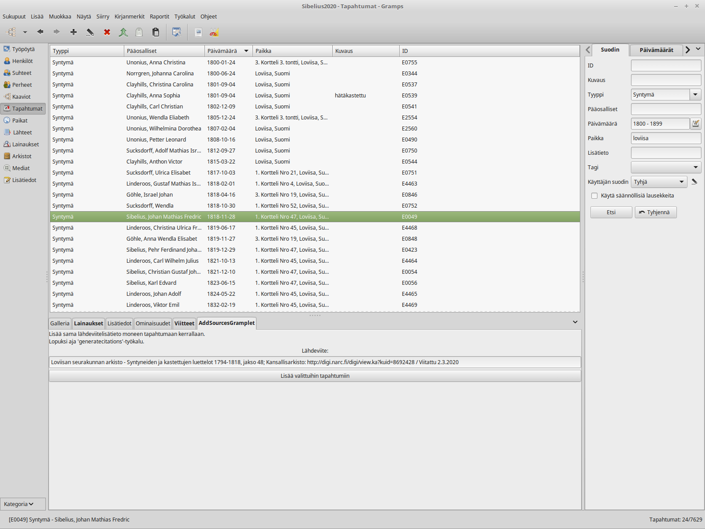

AddSourcesGramplet
------------------
Tekijä: kari.kujansuu@gmail.com
(2.3.2020)

Tämä gramplet toimii yhteistyössä "Muodosta lähdeviitteet lisätietojen perusteella"-työkalun (generatecitations) kanssa.

Tämä gramplet muodostaa tarvittavan lisätiedon tarvitsematta avata ko. tapahtumaa. Riittää kun valitsee halutut tapahtumat
ja kopioi ko. lisätiedon grampletin syöttökenttään ja painaa nappia 'Lisää valittuihin tapahtumiin'. Ko. lisätieto saadaan
digihakemiston tai sshy:n sivulta (sshyn tapauksessa tarvitaan selainlaajennus https://addons.mozilla.org/en-US/firefox/addon/sshy-selainlaajennus/ tai https://chrome.google.com/webstore/detail/sshy-selainlaajennus/caomdaijfcdopklkecajpkoaiamaegkb).

Tämä siis ei tee lähdeviitteitä loppuun saakka, vaan "Muodosta lähdeviitteet lisätietojen perusteella" pitää joka tapauksessa ajaa lopuksi.

