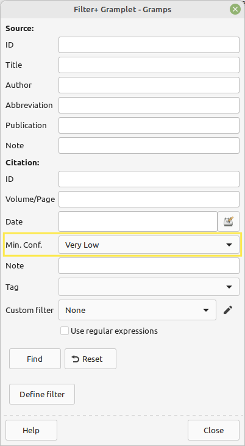

## Filter+: Enhanced Filter Gramplets

These gramplets are slightly enhanced versions of the regular sidebar filter gramplets. The enhancements are:

* There is a new "Define filter" button that automatically creates a custom filter based on the given criteria. This makes it easy to create simple custom filters.

* The Find feature also displays the elapsed time

* There are two new fields in the Person filter: birth and death place

* Family filter: The fields "Father", "Mother" and "Child" behave the same way as in the "Person" filter: one can supply multiple partial names. For example "Joh Smi" will match "John Smith". The regular filter tries to match the entire string exactly. However, this feature is already present in Gramps 5.2.

* The citation filter uses "Very low" as the default confidence level. The regular filter uses "Normal" (which might miss some citations).

Screenshots:

