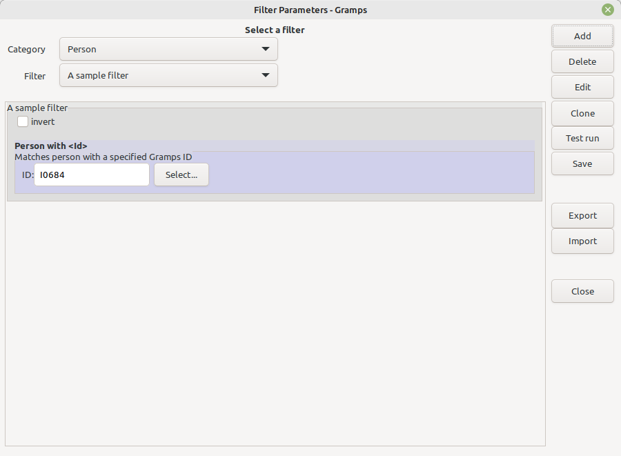
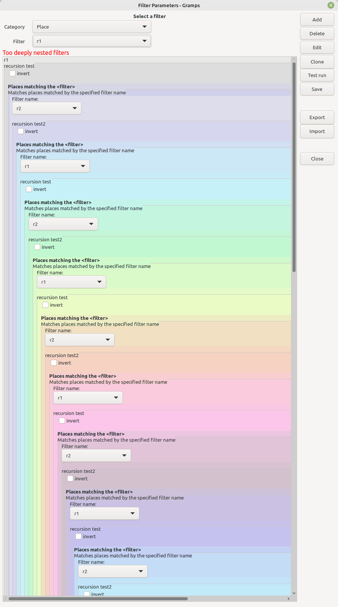
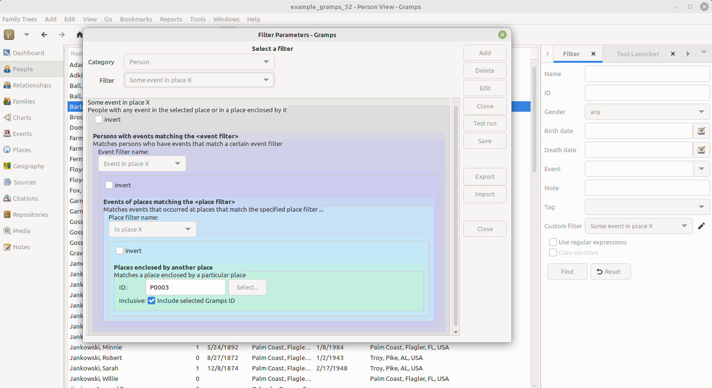

FilterParams
------------
Author: kari.kujansuu@gmail.com 
September 2021 
Updated in July 2025

Gramps add-on that displays the contents and structure of custom filters and allows changing parameters in one screen.

⚠*This is beta code, please back up the custom_filters.xml file before using this.*⚠

For details on custom filters, see https://gramps-project.org/wiki/index.php/Gramps_5.1_Wiki_Manual_-_Filters#Custom_Filters

### Rationale and purpose

Custom filters is a powerful feature of Gramps. The custom filters are built using built-in or third party rules as building blocks. Filters can also use other filters and such nesting can be arbitrarily deep. There is no feature in standard Gramps that would allow seeing the complete structure of a custom filter at a glance. This tool aims to help.

Any rule used by a filter can have parameters. These parameters can be changed by the user before running a filter but this can be quite cumbersome because the relevant parameters can be in a deeply nested filter possibly in a different category. In that case the user would have to first go to another category, find the correct filter and the rule and change the parameter there - and then return to the actual category and filter to perform the operation. This tool allows changing the parameters in one screen that can also remain active while the user is running the filter. That makes running the filter with varying parameters easier.

The tool also automatically synchronizes certain identical parameters so the user does not need to change the same parameter multiple times. See [ID linking](#id-linking)

### Installation

Install the add-on either manually (https://gramps-project.org/wiki/index.php/5.1_Addons#Manually_installed_Addons) or using the instructions here: https://github.com/Taapeli/isotammi-addons

### Usage

Go to the desired category (People, Families etc). Select the FilterParams tool from the Gramps menu (Tools > Isotammi tools > FilterParams). You will see this window:

The first dropdown list contains all categories, the default is the current category. The second dropdown list contains all custom filters for the selected category. The first filter in the list is shown by default. Selecting another one will show its contents, for example

If a filter is using another filter then the contents of that filter is also shown in an embedded frame. The colors are intended to help in visualizing the structure.  Any description (comment) for the filter is shown below the filter name. Likewise, the rule descriptions are shown below the rule names.

Filters nesting is supported up to 10 levels deep. If that is exceeded then the display is truncated and a message is displayed:

Any parameters are shown in a similar manner as in the regular filter rule editor. Change any parameters and press "Test run" - this will apply the filter to all objects in the relevant category and display the result, i.e. objects matching the filter, in a separate window - where you can open the matching objects if needed:

The changed parameter values are not stored. If you want to store the parameter values permanently the press the "Save" button. However, the changed values are available as long as you do not move to another filter or close the tool. This means that if you run the same filter from the sidebar then the changed parameters are in effect.

This tool does not otherwise allow editing of the filters or rules (like adding or deleting filters or rules). For those you have to use the regular filter editor. If filters are changed then you should close and reopen the tool - the filter information is not updated dynamically.

#### Common usage tip

One way to use the tool is to open the same filter simultaneously in this tool and in the sidebar filter gramplet. Any parameter change made using this tool is then immediately used by the sidebar filter (but not stored permanently as noted above).

It is also probably a good idea to name the filters generically, like above: "In place X" - not "In Florida". This makes changing the parameters more natural.

### Other features

#### Adding and editing filters

New custom filters can be added by clicking the 'New' button. The selected filter can be edited with the 'Edit' button. These use the regular Gramps filter editor. The delete button deletes the selected filter. Cloning filters is not supported (at least not yet).

Do not add, edit or delete filters simultaneously with FilterParams and the
regular filter editor.

#### ID linking

A filter can contain the same ID parameter in several places. For example, this filter finds the grandparents of a person:

The ID of the specified person needs to be in two places in the filter. The tool recognizes this and "links" those parameters with each other. Only the first parameter is editable - the other is disabled and dimmed. If you change the first one then the same value is automatically propagated to the other one. 

The linking happens only if the ID values are initially the same.

This feature works for all "ID" type parameters: persons, families, places etc. It works also if there are more than two identical parameters or is there are multiple sets of such parameters (although this is probably quite rare). 

If you need the IDs to be different then you must change the values using the Gramps standard filter editor.

#### Browsing

You can browse through all filters for a category quickly by using the up and down arrow keys.

#### Tooltips

If a custom filter has a comment then the comment is shown as a tooltip when one hovers the mouse over the filter. For individual rules their name and description are displayed.

#### Filter options

The "invert" check box indicates the option "Return values that do not match the filter rules".

The "All/At least one/Exactly one rule must apply" selection appears only if there actually are multiple rules in a filter.

#### Export and Import

These features try to make it easier to share custom filter definitions with other users. The Export button will open a dialog that displays the contents of the current filter and its dependencies in text format. You can then copy the text and send it to other users who can then import the same filters to their Gramps installations. 

This can also be used as backup feature: you can save useful filters as text fragments outside Gramps.

For the sample filter above clicking the Export button yields:

In this case there are three filters (for namespaces Person, Event and Place). The text is automatically copied to the (operating system) clipboard, so you can the paste it for example into a text document. You can also edit the definitions in this phase if needed.

For import, you could first copy the relevant text to the clipboard and then press Import. Assuming the text above is still in the clipboard, you will get:

You can edit this text as needed - or replace it by pasting a different text. Editing should preserve the XML format.

Then press Import in this dialog and the tool tries to import the filters. If there are no issues then the import is finished and the first imported filter is made active in the tool:

If filters with the same name already exist, you will a dialog like:

You can then cancel or overwrite the existing filters.

Canceling gives this message:

In case of an error there may be a message like:

This kind of an error occurs if the text is not valid XML.

