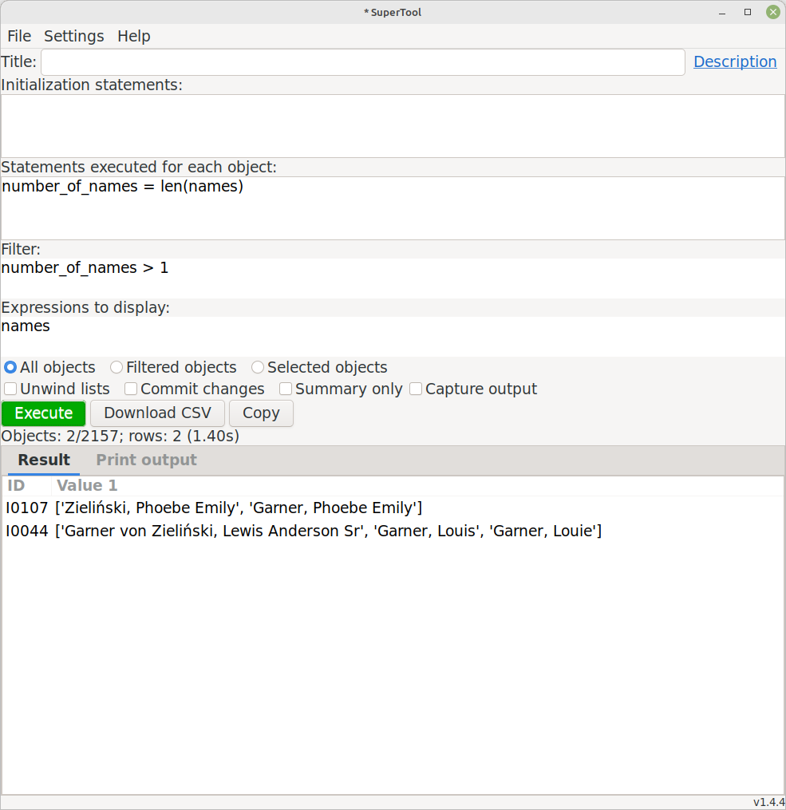

# SuperTool
Author: kari.kujansuu@gmail.com 
1 Jan 2021

This is a general purpose tool that can be used to do "ad-hoc" queries against a Gramps family tree. The queries are expressed in the Python programming language so the tool is most useful for programmers. But the intent is also that the tool is easy enough to allow regular Gramps users to make use of it. The queries can also be saved as script files that a user can then load into the tool without necessarily understanding the details.

This tool works in the Gramps versions 5.x and later. It will be installed in the "Isotammi tools" submenu under the Tools menu.

The tool allows arbitrary Python code so it can also be used to modify the database.

## User interface 

The user interface looks like

The tool has five input text fields:

* Title

* Initialization statements

* Statements executed for each object

* Filter

* Expressions to display

## Basic examples

All the input fields (except Title) will be in Python syntax. All fields are optional but if you want to see any results then the last field, "Expressions to display" must contain something (comma separated Python expressions). For example, if the People category is selected you can simply write "name" in the field, select one or more people from the person list and click "Execute"

You will get the names of the selected person in the in the lower part of the display. The Gramps ID for each person will be automatically inserted in the first column. For example:

This is not very impressive but remember that you can use arbitrary Python syntax in each input field: you can execute one or more arbitrary statements for each object, use a complicated filter if that is needed and display whatever is needed. See examples later in this document.

## Pre-defined variables

Certain pre-defined variables can be used - depending on the current category (People, Families, Events etc).

For example, in the Person/People category the following variables are defined for each person:

* gramps_id
* name
* names
* nameobjs
* birth
* death
* events
* families
* parent_families
* citations
* notes
* tags
* attributes
* person/obj

These are described in detail in the reference section below.

Gramps_id is the ID of the person, for example I0345. Name is the person's primary name in default format. Names is a list of all names assigned to the person. Birth and death are the birth and death events of the person. Events is a list of all events attached to the person etc. You can experiment with all these by putting the variable names in the "Expressions" field.

## Example

Let's experiment with some of these:

Here we display the birth and death dates for these individuals. And also their age at death by subtracting the death and birth dates - the result will be the number of days. We can divide the number of days by 365 to get the approximate age in years:

Or by using a slightly different syntax:

We can order the rows by any column by clicking the column header:

## Accessing Gramps objects

The last predefined variable (person/obj) refers to the actual Gramps Person object (gramps.gen.lib.Person). The variables "person" and "obj" are the same object (i.e. "obj" is an alias for "person"). By using the Person object you can access any internal field or method you like. It goes without saying that this might be quite dangerous if you don't know what you are doing!

## General variables

In addition to the variables mentioned above, the following general variables and functions are also defined:

* db - reference to the database object
* Person, Family, Event etc. - these are the Gramps internal classes
* os, sys, re, functools, collections etc - standard Python modules that might be useful (you can explicitly import any standard module but these are available without importing)
* len, uniq, flatten - some auxiliary functions
* makedate, today - some date helper functions
* filter - a function that returns a custom filter by name

## Help feature

The "Help" button opens a small window that displays variables (or "attributes") available globally or for each object type.

## Options

Under the text input fields there is a set of three radio buttons that determine which objects are processed:
* All objects - all objects in the database of the selected type
* Filtered objects - all displayed objects (applicable if a Gramps regular filter is used)
* Selected objects - only the objects selected by the user (the default)

Next are three checkboxes:
* Unwind lists - if any value in the "Expressions to display" is a list then each member of the list will be shown on a separate row
* Commit changes - any changes to the database are committed only if this is checked
* Summary only - do not display values for every object, only a summary after processing all objects

## Row limit

There is a limit of 1000 rows that can be displayed. This is because Gramps seems to become unstable if an attempt is made to display greater number of rows (maybe a Gtk limitation). if the limit is exceeded then you will get a warning and only the first 1000 rows are displayed:

## Editing objects

Double clicking a row in the result list will open the corresponding object for editing (in the Gramps regular edit dialog). This does not work in "Summary only" mode because then results do not correspond to any individual object.

## Download as CSV

The resulting list can be downloaded as a CSV (Comma Separated Values) file by the "Download CSV" button. There will be a choice of text encoding (utf-8 or iso8859-1/latin1) and value delimiter (comma or semicolon).

## Title field

The first input field ("Title") give a name for the query. This name is saved in the script file (see below) and should be a short description of the operation that is performed. The name is also used as the name of the custom filter created with the "Save as filter" button (see below).

## Initialization statements

The second input field ("Initialization statements") can contain any Python statements that are executed only once in the beginning of the operation. Here you can create any variables needed in the later phases and also import any needed Python (or Gramps) modules. Some gfenerally useful modules are already imported by default. An example of a variable would be a counter that is updated appropriately in the "statements" field and whose final value is displayed in the "expressions" field using the "Summary only" feature.

Here a counter is used to find duplicate places in the database:

## Statements executed for every object 

The statements in "Statements executed for every object" are executed for every object before the filter or expressions are evaluated. This can contain arbitrary Python code, including setting of variables, "if" clauses, function calls and even loops. Note that the filter does not affect these statements - they are executed even if the filter rejects the current object (the filter only affects the display of the data). If filtering is needed the you can use a suitable if clause in this part. This field can, for example, be used to define shortcut variables used in the filter or expressions. This can also contain any database calls that modify the database (if the "Commit changes" checkbox is marked).

This example sets the variable "number_of_names" and then uses it in the filter section:

## Modifying the database

You can modify the database by supplying suitable Python statements in the "Statements executed for each object" section. To be able to do that you of course have to know which Gramps functions to call to make the modifications correctly. That is, you need to know something about Gramps internals. 

Note also that the "Commit changes" checkbox MUST be checked if any modifications are to be made (if the called functions do not do the commits themselves). This acts also as a safeguard to protect for any inadvertent modifications. All changes are done under a transaction and they can be undone from the Gramps menu (Edit > Undo).

For example, this will set the gender of selected people to FEMALE:

## Saving the query as a script file

You can save the query in a file with the "Save" button and load it from a file with the "Load" button. The file is a text file in a JSON (Javascript Object Notation) format. With this you can save useful queries and also distribute them to other Gramps users. These file are also called script files.

## Saving the query as a custom filter

You can also save the query as a Gramps custom filter that is then immediately available to use in the Filter gramplet on the Gramps sidebar. The supplied title will be used as the filter name. Naturally the filter does not include the display list (Expressions to display) but is does inlude the initialization statements, the statements to execute for every object and of course the filter expression itself. 

This can be used to create more complicated filters than is possible with the regular filter editor and built-in rules.

Note that the custom filter requires that SuperTool is installed - so if you remove this tool then such filters also stop working.

## Using predefined custom filters

For each object type the Gramps user can define "custom filters" by using a set of rules. These filters are named and available as part of the "Filter" gramplet normally available on the right hand gramplet sidebar. These filter can be used by SuperTool as follows:

In the "Initialization statements" section obtain  reference to a filter by its name:

    my_ancestors = filter("my ancestors")
    
Then in the subsequent sections you can use the filter for example like:

    if my_ancestors(obj) and ...

## Running from the command line

The tool can also be run from the command line. In that case you have to first save a query in a script file with the "Save" command. That file is used as input file for the tool. Output will go to a CSV file. Of course you also have to supply a family tree (database) name. For example this command will process the family tree named "example_tree", use the script file "old_people.json" and the output will go to a csv file names old_people.csv:

    gramps -O example_tree -a tool -p name=SuperTool,script=old_people.json,output=old_people.csv

The reference section will list all parameters that can be used in the command line mode. In this mode the tool always processes all objects of the given type. The type is read from the script file where it was stored when the file was saved.

## Proxy objects

SuperTool internally uses "proxy objects" to represent the Gramps internal objects. For example, for the Gramps Person object there is a corresponding PersonProxy object. This makes it possible to refer to person attributes and related object by simple expressions. In many cases the proxy objects are invisible to the user but sometimes you have to be aware of these. 

For example, a person's birth event - the "birth" attribute - is actually an EventProxy object. If you display it you will get something like "Event[E0123]". To get the event date and place you need to append the corresponding event attributes: "birth.date" and "birth.place". And even then the "birth.place" refers to a PlaceProxy and to fetch the name of the place you need to use "birth.place.name" or "birth.place.longname".

----------

# Reference

to be added

--------

