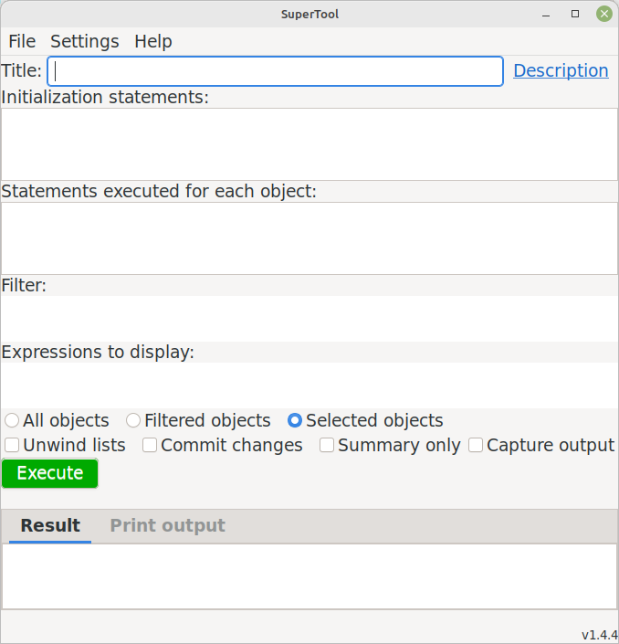
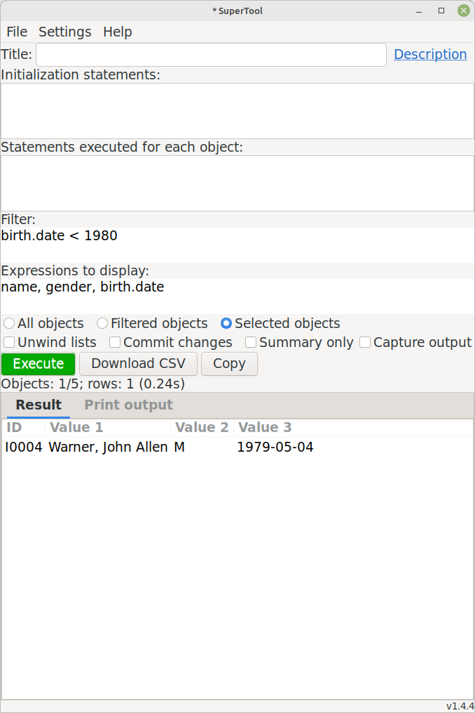
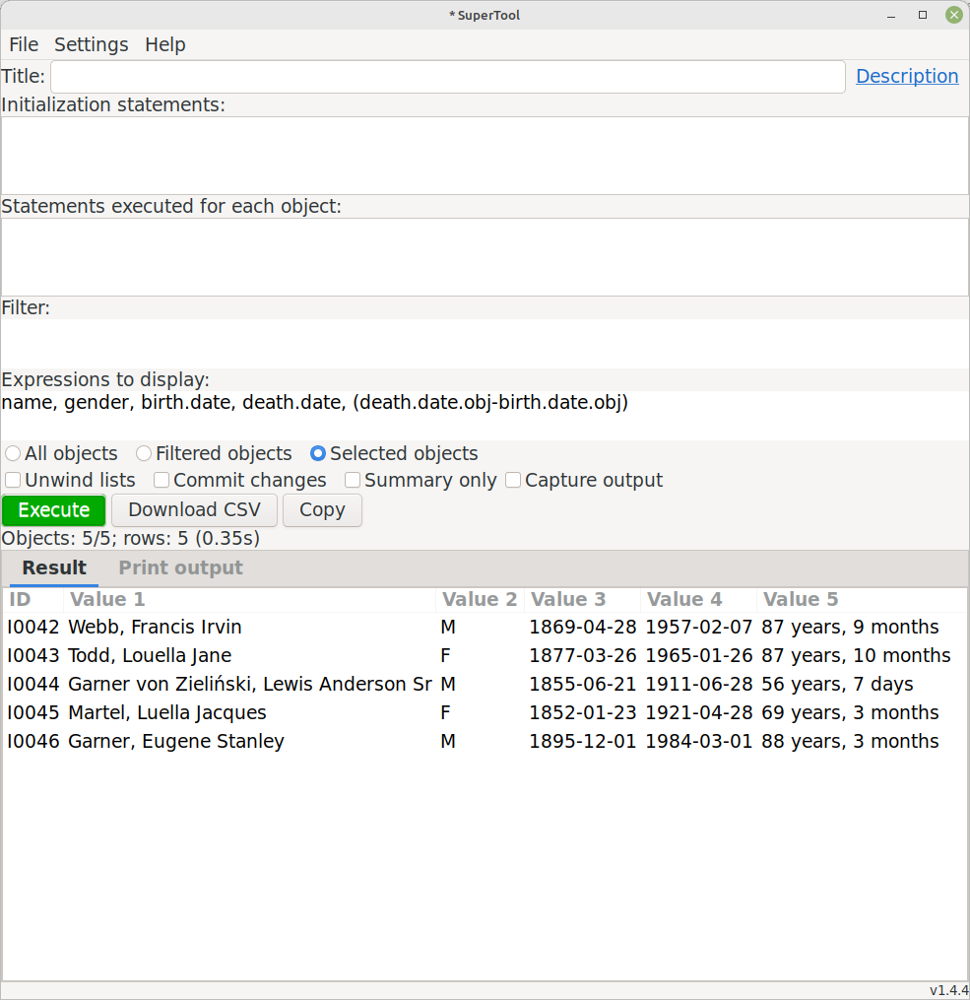
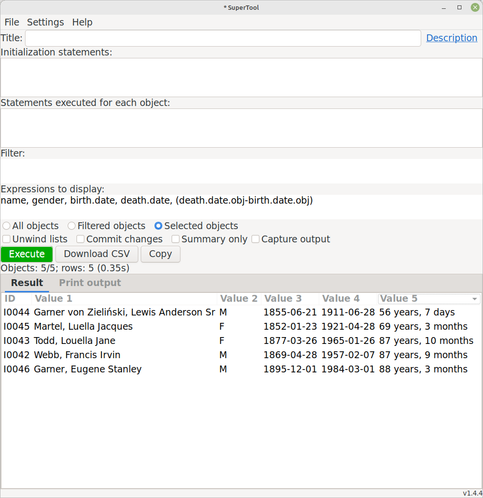
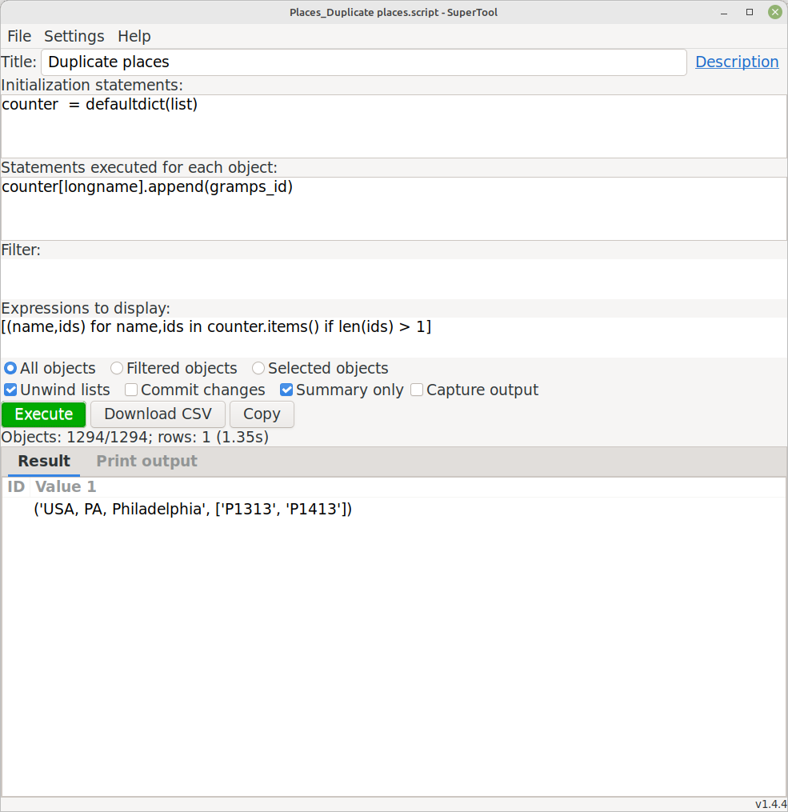
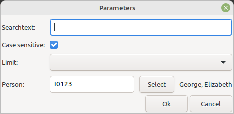
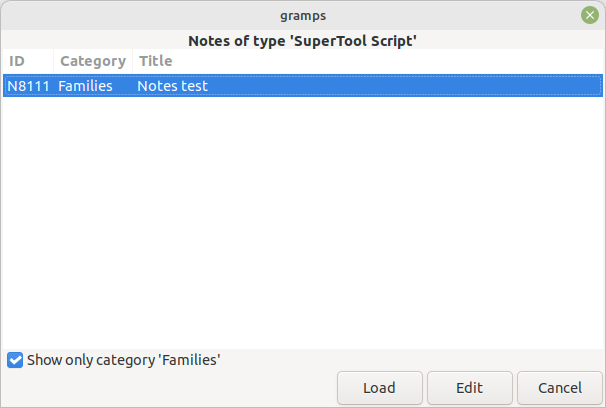

# SuperTool
v1.4.5<br>
13 July 2024<br>
Author: kari.kujansuu@gmail.com<br>

 [Introduction](#introduction)
<br> [User interface](#user-interface)
<br> [Basic examples](#basic-examples)
<br> [Pre-defined variables](#pre-defined-variables)
<br> [Examples](#examples)
<br> [Script description](#script-description)
<br> [Capturing print output](#capturing-print-output)
<br> [Accessing Gramps objects](#accessing-gramps-objects)
<br> [General variables](#general-variables)
<br> [Help feature](#help-feature)
<br> [Options](#options)
<br> [Editing objects](#editing-objects)
<br> [Download/copy as CSV](#download-or-copy-as-csv)
<br> [Title field](#title-field)
<br> [Initialization statements](#initialization-statements)
<br> [Statements executed for every object](#statements-executed-for-every-object)
<br> [Supported object types](#supported-object-types)
<br> [Parameterized queries](#parameterized-queries)
<br> [Modifying the database](#modifying-the-database)
<br> [Deleting objects](#deleting-objects)
<br> [Saving the query as a script file](#saving-the-query-as-a-script-file)
<br> [Saving the query in a Note](#saving-the-query-in-a-note)
<br> [Saving the query as a custom filter](#saving-the-query-as-a-custom-filter)
<br> [Using predefined custom filters](#using-predefined-custom-filters)
<br> [Running from the command line](#running-from-the-command-line)
<br> [Proxy objects](#proxy-objects)
<br> [Date arithmetic](#date-arithmetic)
<br> [Include files](#include-files)
<br> [The 'result' object](#the-result-object)
<br> [Settings](#settings)
<br> [The 'supertool_execute' function](#the-supertool_execute-function)
<br> [More examples](#more-examples)
- [Reference](#reference)
    * [Properties supported by the various object types.](#variables--or-attributes-or-properties--supported-for-the-various-object-types)
    * [Citations](#citations)
    + [Events](#events)
    + [Families](#families)
    + [Notes](#notes)
    + [People](#people)
    + [Places](#places)
    + [Repositories](#repositories)
    + [Sources](#sources)
    + [global variables and functions](#global-variables-and-functions)

- [Command line options](#command-line-options)
- [Sample files](#sample-files)


## Introduction

This is a general purpose scripting tool that can be used to do "ad-hoc" queries against a Gramps family tree/database. The queries are expressed in the Python programming language so the tool is most useful for programmers. But the intent is also that the tool is easy enough to allow regular Gramps users to make use of it. The queries can be saved as script files that a user can then load into the tool without necessarily understanding the details.

This tool works in the Gramps versions 5.x and later. It will be installed in the "Isotammi tools" submenu under the Tools menu.

The tool allows arbitrary Python code so it can also be used to modify the database. Or just to experiment with Python code.

## User interface 

The user interface looks like



The tool has five input text fields:

* Title

* Initialization statements

* Statements executed for each object

* Filter

* Expressions to display

However, if the current category is Dashboard, Relationships, Charts or Geography then the fields "Statements executed for each object" and "Filter" are hidden because they don't make sense in those cases.

The result of the query is displayed in the "Result" tab in the bottom part of the dialog. In addition, if the "Capture output" checkbox is selected, any output from print statements is displayed in the "Print output" tab.

## Basic examples

All the input fields (except Title) will be in Python syntax. All fields are optional but if you want to see any results then the last field, "Expressions to display" must contain something (comma separated Python expressions). For example, if the People category is selected you can simply write "name" in the field, select one or more people from the person list and click "Execute"

You will get the names of the selected person in tabular format in the lower part of the display. The Gramps ID for each person will be automatically inserted in the first column. For example:


Multiple values are displayed in separate columns and the filter expression can be used to select the rows to be displayed:



This is not very impressive but remember that you can use arbitrary Python syntax in each input field: you can execute one or more arbitrary statements for each object, use a complicated filter if that is needed and display whatever is needed. The result list can also be sorted by clicking the column headers. See examples later in this document.


## Pre-defined variables


Certain pre-defined, read-only, variables can be used - depending on the current category (People, Families, Events etc).

For example, in the Person/People category the following variables are defined for each person:

* gramps_id
* name
* surname
* firstname
* names
* nameobjs
* birth
* death
* events
* families
* parent_families
* citations
* notes
* tags
* attributes
* person/obj


Gramps_id is the ID of the person, for example I0345. Name is the person's primary name in default format. Names is a list of all names assigned to the person. Birth and death are the birth and death events of the person. Events is a list of all events attached to the person etc. You can experiment with all these by putting the variable names in the "Expressions" field.

There are also some pre-defined global variables and functions.

These are described in more detail in the reference section below.

## Examples

Let's experiment with some of these:


Here we display the birth and death dates for these individuals. And also their age at death by subtracting the death and birth dates - the result will be the number of days. We can divide the number of days by 365 to get the approximate age in years:


Or by using a slightly different syntax:



We can order the rows by any column by clicking the column header:



Note that none of the above experiments required saving the Python code in a file - everything is executed in memory within the tool. Later we will see how to save a query in a script file.

## Script description

The "Initialization statements" part can be used to briefly document the script by including Python comments. However, the space there is very limited. The "Description" link in the top right corner can be used to write a longer description. That description is also stored in the script file (see [Saving the query as a script file](#saving-the-query-as-a-script-file)).

Clicking the link will open a new window where the description can be written or edited. Clicking OK will then save the description in SuperTool - but it will NOT be stored in a script file until the script is saved from the menu (File > Save). The asterisk at the window header will indicate that there are unsaved changes.

## Capturing print output

Python code can contain print statements (e.g. "<i>print('Value is', value)</i>". If Gramps is started in console mode then the print output will normally go to the console. Without the console the output is lost except that in Windows it goes to the GrampsXX.log file (e.g. Gramps51.log). Print output is free-form, so it cannot be displayed in the Result tab.

However, if the "Capture output" checkbox is checked, then SuperTool will save the output and display it in the "Print output" tab. This can be used e.g. for debugging the script or other purposes.

There are restrictions: each print line can be at most 1000 characters long the and the complete output must be at most 100 kB. This is because I noticed that, at least in some Linux systems, Gramps will get an X Window error and crash if the output is longer. 


## Accessing Gramps objects

The last predefined variable (person/obj) refers to the actual Gramps Person object (gramps.gen.lib.Person). The variables "person" and "obj" are the same object (i.e. "obj" is an alias for "person"). By using the Person object you can access any internal field or method you like. It goes without saying that this might be quite dangerous if you don't know what you are doing!

## General variables

In addition to the variables mentioned above, the following general/global variables and functions are also defined:

* os, sys, re, functools, collections etc - standard Python modules that might be useful (you can explicitly import any standard module but these are available without importing)
* db - reference to the database object
* trans - the current transaction
* Person, Family, Event etc. - these are the Gramps internal classes
* len, uniq, flatten - some auxiliary functions
* makedate, today - date helper functions
* filter - a function that returns a custom filter by name
* getargs - ask the user for input 
* category - Dashboard, People, Families etc.
* namespace - Person, Family, Event etc.
* getproxy - a function to convert a Gramps internal object to a proxy object

## Help feature

The "Help" menu opens a small window that displays the variables (or "attributes") available globally or for each object type. There is also a link to this document.


## Options

Under the text input fields there is a set of three radio buttons that determine which objects are processed:


* All objects - all objects in the database of the current type/category
* Filtered objects - all displayed objects (applicable if a Gramps regular sidebar filter is used)
* Selected objects - only the object or objects that the user has selected from the list (the default)

Next are four checkboxes:


* Unwind lists - if any value in the "Expressions to display" is a list then each member of the list will be shown on a separate row
* Commit changes - any changes to the selected objects are automatically committed if this is checked
* Summary only - do not display values for every object, only a summary after processing all objects
* Capture output - capture output of print statements and show it in the 'Print output' tab

## Editing objects

Double clicking a row in the result list will open the corresponding object for editing (in the Gramps regular edit dialog). This does not work in "Summary only" mode because then results do not correspond to any individual object.

## Download or copy as CSV

The result list can be downloaded as a CSV (Comma Separated Values) file by the "Download CSV" button (which will appear after a successful query). There will be a choice of text encoding (utf-8 or iso8859-1/latin1) and value delimiter (comma or semicolon).
There is also a "Copy" button which will copy the result list to clipboard in the CSV format. However, in this case the format always uses utf-8 encoding and comma as delimiter.

## Title field

The first input field ("Title") gives a name to the query. This title is used as the default name for a saved script file (see below) and should be a short description of the operation that is performed. The title is also used as the name of the custom filter created with the [Save as filter](#saving-the-query-as-a-custom-filter) command (see below).

## Initialization statements

The second input field ("Initialization statements") can contain any Python statements that are executed only once in the beginning of the operation. Here you can create any variables or functions needed in the later phases and also import any needed Python (or Gramps) modules. Some generally useful modules are already imported by default. An example of a variable would be a counter that is updated appropriately in the "statements" field and whose final value is displayed in the "expressions" field using the "Summary only" feature.

This field can contain regular Python comments (lines starting with a hash sign: #).

In this example a counter is used to find duplicate places in the database. The city of Philadelphia appears twice in the database, using Gramps IDs P1313 and P1413. Run this in the Places category.



## Statements executed for every object 

The statements in "Statements executed for each object" are executed for every object before the filter or expressions are evaluated. This can contain arbitrary Python code, including setting of variables, "if" clauses, function calls and even loops. Note that the filter does not affect these statements - they are executed even if the filter rejects the current object (the filter only affects the display of the data). If filtering is needed then you can use a suitable if clause in this part. This field can, for example, be used to define shortcut variables used in the filter or expressions. This can also contain any database calls that modify the database (if the "Commit changes" checkbox is marked).

This field can contain regular Python comments (lines starting with a hash sign: #).

This example sets the variable "number_of_names" and then uses it in the filter section:


## Supported object types

The tool supports all object types (categories) that have a list view in the Gramps user interface: People, Families, Events, Places, Citations, Sources, Repositories, Media and Notes. 

For other categories (Dashboard, Relationships, Charts or Geography) the tool only has the input fields "Initialization statements" and "Expressions to display". The "Summary only" mode is always used.

The tool will remember the script last executed for each object type. Therefore, when you switch to another view, the contents of the input fields will change.

## Parameterized queries

You can use the global 'getargs' function to ask the user for parameters to a query. This function should be called in the initialization code and the syntax is:

```python
args = getargs(argname=description, argname=description, ...)
```

The value of 'description' can be a string or a three-element tuple. If it is a string then the string is used as a label for the value in a dialog. For example:


```python
args = getargs(text="Searchtext", limit="Limit")
print("Limit is", args.limit)
```
This will first display a dialog like


If the user presses "OK" then the script continues normally. The supplied value can be used in the script by using the 'argname' as a property of the 'args' object, e.g. 'args.limit'.

The 'description' can also be a tuple of format (label, type, value). The label is a string used as a label. Type can be 'bool' or 'list' (without quotes). 

If the type is 'bool' then the dialog displays a checkbox. The value can be True or False and it determines if the checkbox is initially checked or not.

If the type is 'list' then value must be a list of values that are displayed in a dropdown list. The values can be of any type (that can be converted to a string).

If the type is 'person' (as a string, include the quotes) then the returned value is a person proxy object. There is also a text box that contains the gramps ID of the person and a 'Select' button that allows the user to select a specific person. It is also possible to select a person by filling the gramps ID field and pressing Enter. The name of the selected person is displayed beside the 'Select' button. 
For example:

```python
args = getargs(text="Searchtext:", 
    case_sensitive=("Case sensitive:", bool, True), 
    limit=("Limit:", list, [50,100,500]),
    person=("Person:", 'person', "I0123")
    )
```
This will first display a dialog like




The given values are saved and reused as defaults when getargs is called the next time. 
Note: if you change to another database, then the saved gramps ID (for a person selection) will point to a person in the current database.

If the user presses "Cancel" then the query is canceled:

This feature may be enhanced or changed in the future. It does work with 
[saved filters](#saving-the-query-as-a-custom-filter) so this is a way to parameterize filters. But canceling a getargs call when called from a filter does not work cleanly - it will throw an unexpected exception.

The 'getargs' function can also be used in the command line mode. 

## Modifying the database

You can modify the database by supplying suitable Python statements in the "Statements executed for each object" section. To be able to do that you of course have to know which Gramps functions to call to make the modifications correctly. That is, you need to know something about Gramps internals. See e.g. the documentation at https://www.gramps-project.org/docs/gen/gen_lib.html, 
the Gramps Data Model at https://gramps-project.org/wiki/index.php/Gramps_Data_Model
and, of course, Gramps source code at https://github.com/gramps-project/gramps.

All queries are done under a transaction and any changes can be undone from the Gramps menu (Edit > Undo).

For example, this will set the gender of selected people to FEMALE:


Note that you cannot change the properties of the objects by simply assigning new values to properties of *Proxy* objects (see [Proxy objects](#proxy-objects)). For example, in the People category, this does not work:

```python
gender = Person.FEMALE
```
    
But this works:

```python
person.gender = Person.FEMALE
```

This is because the 'person' object is the Gramps internal Person object, not the PersonProxy object.
    
However, the recommended way would be to use the corresponding setter method as in the example above:

```python
person.set_gender(Person.FEMALE)
```

All changes must also be "committed". If you check the "Commit changes" checkbox then all changes to the processed objects in the current category are committed automatically. You could also explicitly commit the changes by for example

```python
   db.commit_person(person, trans)
```

But this is not necessary or recommended. However, if you make changes to *other* objects than the currently selected objects then you must call a commit method. For example, if you process objects in the Family category and make changes to children of the family then you must commit the changes explicitly, e.g. something like this:

    for child in children:
        if some-condition:
            child.obj.set_gender(Person.FEMALE)
            db.commit_person(child.obj, trans)

Note that the argument to "db.commit_person" is the actual Gramps object (child.obj), not the corresponding Proxy object (child). This kind of an explicit commit is performed even if the 'Commit changes' checkbox is not selected.

## Deleting objects

If you delete an object from the database then you should set the object's "commit_ok" attribute to False:

```python
obj.commit_ok = False
```

This is because the tool automatically commits all processed objects if the "Commit changes" checkbox is marked. However, if a deleted object is committed, then it will be re-inserted in the database (this is how Gramps works). Setting <i>commit_ok</i> to False will prevent this. This attribute is set in the actual Gramps object.

## Saving the query as a script file

The File menu has choices to save the query in a file (Save) and load a query from a file (Open). With this you can save useful queries and also distribute them to other Gramps users. These files are also called script files. They are human-readable text files that can also be edited with an external editor. Be careful not to mix spaces and tabs though. These files are always stored in UTF-8 encoding.

The script files have the extension ".script" by default.

The "New" command will clear all input fields.


## Saving the query in a Note

A query can also be saved in the current Gramps database (family tree) as a Note of the type 'SuperTool Script'. This feature is available starting from SuperTool version 1.3.8 and it adds two new items in the 'File' menu:


Selecting 'Load from Note' displays a list of saved notes (if any) and allows the user to edit them or load one of them as the current query:



Selecting 'Save as Note' also displays the list of saved notes and allows the user to overwrite one of them with the current query or create a new Note:


By default the lists only show queries for the current category.


## Saving the query as a custom filter

You can also save the query as a Gramps custom filter that is then immediately available to use in the Filter gramplet on the Gramps sidebar. The supplied title will be used as the filter name. Naturally the filter does not include the display list (Expressions to display) but it does include the initialization statements, the statements to execute for every object and of course the filter expression itself. 

This can be used to create more complicated filters than is possible with the regular filter editor and built-in rules.

The filters can use the 'getargs' function, see [Parameterized queries](#parameterized-queries).

Some 'global variables' are not available in a custom filter: trans, uistate and result are always None. The 'dbstate' variable exists but does not refer to the real dbstate object and it only contains the 'db' attribute.

Note that the custom filter requires that SuperTool is installed - so if you remove this tool then such filters also stop working.

## Using predefined custom filters

For each object type the Gramps user can define "custom filters" by using a set of rules. These filters are named and available as part of the "Filter" gramplet normally available on the right hand gramplet sidebar. These filters can be used by SuperTool as follows:

In the "Initialization statements" section obtain  reference to a filter by its name:

```python
    my_ancestors = filter("my ancestors")
```
    
Then in the subsequent sections you can use the filter for example like:

```python
    if my_ancestors(obj) and ...
```

A filter in a different namespace can also be accessed by including the 'namespace' parameter:

```python
    my_ancestors = filter("my ancestors", namespace="Person")
```

 
## Running from the command line
 
The tool can also be run from the command line. In that case you have to first save a query in a script file with the "Save" command. That file is used as input file for the tool. Output will go to the screen or to a CSV file. Of course you also have to supply a family tree (database) name or an input file. For example this command will process the family tree named "example_tree", use the script file "old_people.script" and the output will go to a csv file named old_people.csv:

    gramps -O example_tree -a tool -p name=SuperTool,script=old_people.script,output=old_people.csv

This example will read a .gramps file, create a temporary family tree and the run the script:

    gramps -i example_tree.gramps -a tool -p name=SuperTool,script=old_people.script,output=old_people.csv

The reference section will list all parameters that can be used in the command line mode. In this mode the tool always processes all objects of the given category (People, Families etc). The category is read from the script file where it was stored when the file was saved. The type can be overridden with the parameter "category", for example

    gramps -i example_tree.gramps -a tool -p name=SuperTool,script=old_people.script,output=old_people.csv,category=People

## Proxy objects

SuperTool internally uses "proxy objects" to represent the Gramps internal objects. For example, for the Gramps Person object there is a corresponding PersonProxy object. This makes it possible to refer to person attributes and related objects (like families, notes etc.) by simple expressions. In many cases the proxy objects are invisible to the user but sometimes you have to be aware of these. 

For example, a person's birth event - the "birth" attribute - is actually an EventProxy object. If you display it you will get something like "Event[E0123]". To get the event date and place you need to append the corresponding event attributes: "birth.date" and "birth.place". And even then the "birth.place" refers to a PlaceProxy and to fetch the name of the place you need to use "birth.place.name" or "birth.place.longname".

Proxy objects are created when they are needed. In an earlier version of SuperTool his meant also that identical expressions did not always refer to the same objects. This is not a problem any longer since all objects are cached automatically (using CacheProxyDb) and therefore there will be only one memory object per handle. You can update attributes for example in the following way:

```python
# ok:
death.obj.description = 'Died in war'
db.commit_place(death.obj, trans)
```

## Date arithmetic


Date properties (like birth.date) return a DateProxy object. Currently the dates work like this:

* Adding an integer to a DateProxy will add that many <b>years</b> to the date:
** (2021-01-11) + 1 -> 2022-01-11

* Subtracting an integer from a DateProxy will subtract that many <b>years</b> from the date:
** (2021-01-11) - 1 -> 2020-01-11

* But subtracting two DateProxys will yield the number of <b>days</b> between the dates:
** (2022-01-11) - (2021-01-11) -> 365

This is a bit contradictory, maybe this will change in the future...

Dates can also be compared: 

```python
    # died under the age of one year
    if death.date <= birth.date + 1:
        ...
```

In many cases you should first check that a date exists (ie. the corresponding event has a defined date). Otherwise the date comparisons and arithmetic might not work as expected. This can be done like this:

```python
    # died under the age of one year
    if birth.date and death.date and death.date <= birth.date + 1:
        ...
```


## Include files

The Python statement parts can include code from a file with the syntax

    @include file-name
    
This code must be the only text on a line and it must start from the first column and contain exactly the text "@include" (in lower case, with the at sign included). If the file name is not fully qualified (i.e an absolute path) then SuperTool will look at three places:
* in the same folder/directory where the script file is (if the query is loaded from a script file)
* in a folder/directory called "supertool" under the user's home directory ($HOME/supertool)
* in the place where SuperTool is installed (i.e. $HOME/.gramps/gramps51/plugins/SuperTool on Linux)
* the current directory for the Gramps process (usually the user's home directory)

However, the "supertool" directory can be changed from [settings](#settings)

So it is intended that the user can store often used include files in her own "supertool" folder.

The text from the specified file is included 'as-is' at the point where the include command was found. So this is not the same as importing the module - although the include file contains Python code and usually has the .py extension. These files should always be stored in UTF-8 encoding.

The included code cannot contain @include statements.

This is intended to allow including possibly complex auxiliary functions without cluttering the user interface. The included code naturally has access to all pre-defined variables. The SuperTool installation will eventually contain a few include files with generally useful functions. 

## The 'result' object

This is an experimental feature. There is a pre-defined variable 'result' which is an object with the following methods:
- add_row()
- set_coltypes()
- set headers()
- set_max()

Normally the rows displayed will correspond to the processed Gramps objects. With 'result.add_row(data)' you can add arbitrary data to the result. The 'data' argument must be a list with values to be displayed. The number and types of the values must be consistent: there must be the same number of values in each call of add_row and the number must be the same as the number of items in the "Expressions to display" field (if any). The types (str, int or float) must also match (all other types are converted to strings).

The 'add_row' function also accepts thee optional parameter 'obj'. These can be used if you want the row to correspond to a specific Gramps object. Double-clicking the row will then open the corresponding object editor. For example this code will display the parents of the family and their children - and also allow the children be edited (this should be run in the Families category):

```python
result.add_row([father.name, mother.name], obj=self)
for child in children:
    result.add_row(["", child.name], obj=child)
```

Note that both families and individuals appear in the result:


Note: the 'add_row' method also accepts parameters gramps_id, handle, namespace and category which can also be used to specify the object. However, in most cases it is sufficient and simpler to use the 'obj' parameter.

Normally the types of the columns are detected when the first row is generated. The subsequent rows must use the same types. The 'set_coltypes' can be called in advance to set the column types. It is not clear if this is ever needed, though :-)

Normally the column headers are "Value 1", "Value 2" etc. With 'set_headers' you can specify different headers. For example;
 
```python
result.set_headers(["Name", "Age"])
```
 
With 'set_max' you can specify the maximum number of rows displayed. This maximum takes effect after the 'Filter' is processed. The method has also a second parameter 'read_limit' that specifies the maximum number of objects to process before filtering.

## Settings

The Settings menu opens a settings dialog where you can change two values:
* the font of the user interface
* the default folder/directory for the [@include files](#include-files)

If you change the directory for the @include files then you should move all existing files to the new directory. Otherwise scripts (and filters) that use the files do not work anymore.


## The 'supertool_execute' function

It occured to me that SuperTool could also need an API (Application Programming Interface) so that one could use SuperTool type of scripting from another addons or other programs within Gramps.

Warning: this is an experimental feature. Or rather, more experimental than the other features :-)

The function supertool_execute resides in the module supertool_utils. This module is automatically loaded at Gramps startup so it is always available to other addons. So one could write

```python
from supertool_utils import supertool_execute
rsp = supertool_execute(...)
print(rsp.rows)
```

The arguments to supertool_execute mirror the input fields in the SuperTool user interface. The signature is

```python
def supertool_execute( *, 
    category, 
    dbstate, 
    db, 
    trans=None,
    handles=None, 
    initial_statements=None, 
    statements=None, 
    filter=None, 
    expressions=None, 
    summary_only=False, 
    unwind_lists=False, 
    commit_changes=False, 
    args="")
```

The return value of this function contains the rows generated by the query. 

A more detailed description will be in a separate document.


## More examples

to be added


# Reference

## Variables (or attributes or properties...) supported for the various object types.

This diagram shows attributes and the relationships between object types (i.e. proxy classes). For clarity, some of the relationship arrows have been omitted. 

The notation

    father: Person

means that the "father" attribute refers to an object of type "Person" (actually PersonProxy, see [Proxy objects](#proxy-objects)).

An asterisk after the type name means that the attribute is a list of objects, e.g.

    events: Event*


Note: the 'media_list' attribute is missing from this diagram.

The corresponding diagram for Gramps object (Gramps Data Model) is at https://gramps-project.org/wiki/index.php/Gramps_Data_Model


The lists below include the attributes defined in the various proxy classes. In addition, you can naturally use all properties and methods of the Gramps objects and Python libraries.

### Citations

property             | description                                        | type
-------------------- | ------------------------------------------------   | --------------------
attributes           | Attributes as a list of tuples (name,value)        | list of (string,string)
citation             | This Gramps Citation object (same as 'obj')        | Citation
citators             | Objects referring to this citation                 | 
confidence           | Confidence value (0-4)                             | integer
date                 | Date of the citation                               | DateProxy
gramps_id            | Gramps id, e.g. C0123                              | string
handle               | Gramps internal handle                             | string
media_list           | List of media objects                              | list of MediaProxy objects
notes                | List of notes                                      | list of NoteProxy objects
obj                  | This Gramps Citation object (same as 'citation')   | Citation
page                 | Page value                                         | string
self                 | This CitationProxy object                          | CitationProxy
source               | Source                                             | SourceProxy
tags                 | List of tags as strings                            | list of strings

### Events

property             | description                                                          | type
-------------------- | ------------------------------------------------------------------   | --------------------
attributes           | Attributes as a list of tuples (name,value)                          | list of (string,string)
citations            | List of citations                                                    | list of CitationProxy objects
date                 | Date of the event                                                    | DateProxy
description          | Event description                                                    | string
event                | This Gramps Event object (same as 'obj')                             | Event
gramps_id            | Gramps id, e.g. E0123                                                | string
handle               | Gramps internal handle                                               | string
media_list           | List of media objects                                                | list of MediaProxy objects
notes                | List of notes                                                        | list of NoteProxy objects
obj                  | This Gramps Event object (same as 'event')                           | Event
participants         | Participants of the event (person objects)                           | list of PersonProxy objects
place                | Place object of the event                                            | PlaceProxy
placename            | Name of the place of the event, taking into account the event date   | string
refs                 | Ref objects referring to this event                                  | list of Ref objects
role                 | Role of the event                                                    | string
self                 | This EventProxy object                                               | EventProxy
tags                 | List of tags as strings                                              | list of strings
type                 | Type of the role as string                                           | string

### Families

property             | description                                    | type
-------------------- | --------------------------------------------   | --------------------
attributes           | Attributes as a list of tuples (name,value)    | list of (string,string)
children             | Person objects of the family's children        | list of PersonProxy objects
citations            | List of citations                              | list of CitationProxy objects
events               | List of all events attached to this family     | list of EventProxy objects
family               | This Gramps Family object (same as 'obj')      | Family
father               | Person object of the family's father           | PersonProxy
gramps_id            | Gramps id, e.g. F0123                          | string
handle               | Gramps internal handle                         | string
media_list           | List of media objects                          | list of MediaProxy objects
mother               | Person object of the family's mother           | PersonProxy
notes                | List of notes                                  | list of NoteProxy objects
obj                  | This Gramps Family object (same as 'family')   | Family
reltype              | Relationship type                              | string
self                 | This FamilyProxy object                        | FamilyProxy
tags                 | List of tags as strings                        | list of strings


### Media

property             | description                                   | type
-------------------- | -------------------------------------------   | --------------------
attributes           | Attributes as a list of tuples (name,value)   | list of (string,string)
checksum             | Checksum for the media object                 | string
citations            | List of citations                             | list of CitationProxy objects
date                 | Date for the media object                     | DateProxy
desc                 | Description for the media object              | string
gramps_id            | Gramps id, e.g. O0123                         | string
handle               | Gramps internal handle                        | string
media                | This Gramps Media object (same as 'obj')      | Media
mime                 | Mime type                                     | string
notes                | List of notes                                 | list of NoteProxy objects
obj                  | This Gramps Media object (same as 'media')    | Media
path                 | Path to the media object                      | string
self                 | This MediaProxy object                        | MediaProxy
tags                 | List of tags as strings                       | list of strings


### Notes

property             | description                                | type
-------------------- | ----------------------------------------   | --------------------
gramps_id            | Gramps id, e.g. N0123                      | string
handle               | Gramps internal handle                     | string
note                 | This Gramps Note object (same as 'obj')    | Note
obj                  | This Gramps Note object (same as 'note')   | Note
self                 | This NoteProxy object                      | NoteProxy
tags                 | List of tags as strings                    | list of strings
text                 | Text of the note                           | string
type                 | Type of the note                           | string


### People

property             | description                                      | type
---------------------|------------------------------------------------- | ----------------------
attributes           | Attributes as a list of tuples (name,value)      | list of (string,string)
birth                | Birth event                                      | EventProxy
children             | List of person's children                        | list of PersonProxy objects
citations            | List of citations                                | list of CitationProxy objects
death                | Death event                                      | EventProxy
events               | List of all events attached to this person       | list of EventProxy objects
families             | List of families where this person is a parent   | list of FamilyProxy objects
firstname            | First name in the person's primary name          | string
father               | Person's father                                  | PersonProxy object (or Nullproxy)
gender               | Gender as as string: male, female or unknown     | string
gramps_id            | Gramps id, e.g. I0123                            | string
handle               | Gramps internal handle                           | string
media_list           | List of media objects                          | list of MediaProxy objects
mother               | Person's mother                                  | PersonProxy object (or Nullproxy)
name                 | Primary name as string                           | string
nameobjs             | List of Gramps internal Name objects             | list of Name objects
names                | List of names as strings                         | list of strings
notes                | List of notes                                    | list of NoteProxy objects
obj                  | This Gramps Person object (same as 'person')     | Person object
parent_families      | List of families where this person is a child    | list of FamilyProxy objects
parents              | List of person's parents                         | list of PersonProxy objects
person               | This Gramps Person object (same as 'obj')        | Person object
self                 | This PersonProxy object                          | PersonProxy
spouses              | List of person's spouses                         | list of PersonProxy objects
suffix               | Suffix name in the person's primary name         | string
surname              | Surname in the person's primary name             | string
tags                 | List of tags as strings                          | list of strings


### Places

property             | description                                  | type
-------------------- | ------------------------------------------   | --------------------
altnames             | List of alternate names                      | list of strings
citations            | List of citations                            | list of CitationProxy objects
enclosed_by          | List of places that enclose this place       | list of PlaceProxy objects
encloses             | List of places that this place encloses      | list of PlaceProxy objects
events               | List of events that occurred in this place   | list of EventProxy objects
gramps_id            | Gramps id, e.g. P0123                        | string
handle               | Gramps internal handle                       | string
longname             | Full name including enclosing places         | string
media_list           | List of media objects                        | list of MediaProxy objects
name                 | Name of the place                            | string
notes                | List of notes                                | list of NoteProxy objects
obj                  | This Gramps Place object (same as 'place')   | Place
place                | This Gramps Place object (same as 'obj')     | Place
self                 | This PlaceProxy object                       | PlaceProxy
tags                 | List of tags as strings                      | list of strings
title                | Title of the place                           | string
type                 | Type of the place as string                  | string

### Repositories

property             | description                                            | type
-------------------- | ----------------------------------------------------   | --------------------
gramps_id            | Gramps id, e.g. R0123                                  | string
handle               | Gramps internal handle                                 | string
name                 | Repository name                                        | string
notes                | List of notes                                          | list of NoteProxy objects
obj                  | This Gramps Repository object (same as 'repository')   | Repository
repository           | This Gramps Repository object (same as 'obj')          | Repository
self                 | This RepositoryProxy object                            | RepositoryProxy
sources              | List of sources in this repository                     | list of SourceProxy objects
tags                 | List of tags as strings                                | list of strings
type                 | Type of repository                                     | string

### Sources

property             | description                                    | type
-------------------- | --------------------------------------------   | --------------------
abbrev               | Abbreviation                                   | string
attributes           | Attributes as a list of tuples (name,value)    | list of (string,string)
author               | Author                                         | string
citations            | List of citations                              | list of CitationProxy objects
gramps_id            | Gramps id, e.g. S0123                          | string
handle               | Gramps internal handle                         | string
media_list           | List of media objects                          | list of MediaProxy objects
notes                | List of notes                                  | list of NoteProxy objects
obj                  | This Gramps Source object (same as 'source')   | Source
pubinfo              | Publication info                               | string
repositories         | List of repositories                           | list of RepositoryProxy objects
self                 | This SourceProxy object                        | SourceProxy
source               | This Gramps Source object (same as 'obj')      | Source
tags                 | List of tags as strings                        | list of strings
title                | Source title                                   | string

### global variables and functions

property             | description                                                                           | 
-------------------- | -----------------------------------------------------------------------------------   | 
active_person        | Active person                                                                         |
category             | Category, e.g. 'Dashboard', 'People' etc.                                             |
db                   | Database object                                                                       | 
dbstate              | Database state  object                                                                | 
filter               | Function that returns a custom filter by name                                         | 
flatten              | Function that returns elements from nested lists                                      | 
getargs              | Function that asks the user for parameters to be used in the query                    | 
getproxy             | Function to convert a Gramps internal object to a proxy object                        | 
makedate             | Function to construct a date value; e.g. makedate(1800, 12, 31) or makedate(1800)     | 
namespace            | E.g. 'Person', 'Family' etc. None for unsupported categories (Dashboard etc.)         |
referrers(category)  | Function returning objects of type 'category' that refer to this object               |
result               | A special object (see above)                                                          |
today                | Function that returns today's date                                                    |
trans                | Current transaction                                                                   |
uistate              | UI state  object                                                                      | 
user                 | Gramps internal user object                                                           | 
uniq                 | Function that returns unique elements from a list                                     | 

### --

## Command line options

The basic command line syntax is like:

    gramps -O example_tree -a tool -p name=SuperTool,script=old_people.script,output=old_people.csv

or

    gramps -i example_tree.gramps -a tool -p name=SuperTool,script=old_people.script,output=old_people.csv

See "gramps -h" or https://gramps-project.org/wiki/index.php/Gramps_5.1_Wiki_Manual_-_Command_Line.

Possible options in the "-p" (or --options) argument:

####    script
Specifies the script file to use. Required.

####    output
Specifies the output CSV file. Optional. If not used then the output will go to the screen.

####    category
Specifies the category (People, Families, Events etc). Overrides the category in the script file. Optional. 

####    args
Free form argument that the script can access (as variable 'args'). Optional. Like all options cannot contain spaces or commas. 

####    profile
If profile is set to 1 (profile=1) then the Python profiler (https://docs.python.org/3/library/profile.html) is invoked and the profiling results are displayed after running the script. Optional.

## Sample files

### Sample script files

### Sample include files

to be added

## Script file format

to be added


