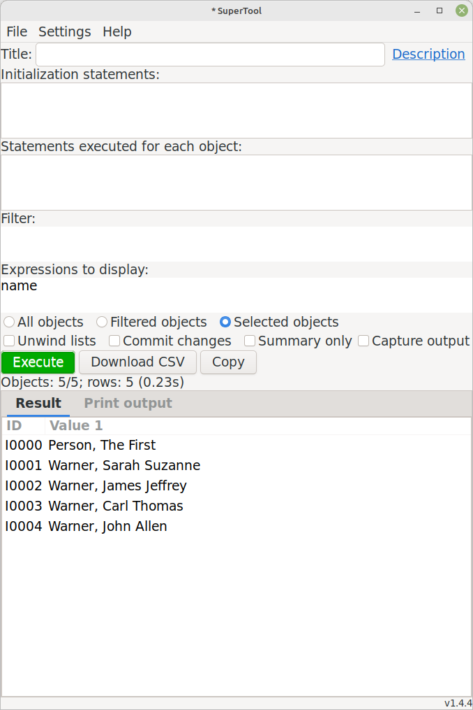
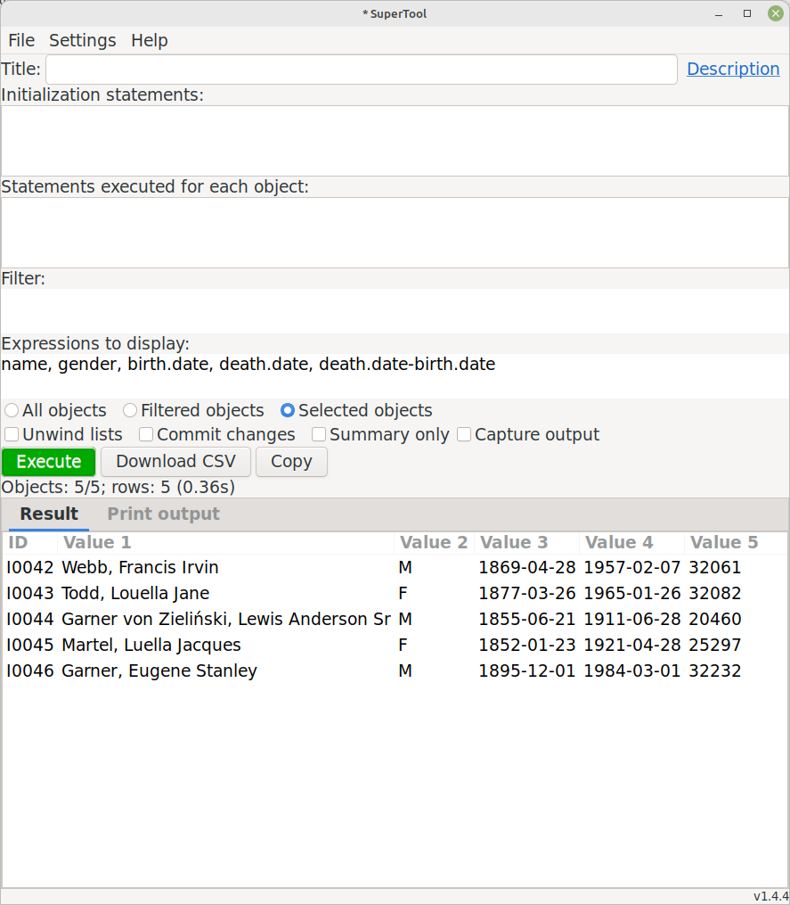
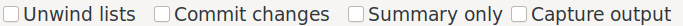

# SuperTool
Author: kari.kujansuu@gmail.com<br>
1 Jan 2021

- [Introduction](#introduction)
- [User interface](#user-interface)
- [Basic examples](#basic-examples)
- [Pre-defined variables](#pre-defined-variables)
- [Example](#example)
- [Accessing Gramps objects](#accessing-gramps-objects)
- [General variables](#general-variables)
- [Help feature](#help-feature)
- [Options](#options)
- [Row limit](#row-limit)
- [Editing objects](#editing-objects)
- [Download as CSV](#download-as-csv)
- [Title field](#title-field)
- [Initialization statements](#initialization-statements)
- [Statements executed for every object](#statements-executed-for-every-object)
- [Supported object types](#supported-object-types)
- [Modifying the database](#modifying-the-database)
- [Deleting objects](#deleting-objects)
- [Saving the query as a script file](#saving-the-query-as-a-script-file)
- [Saving the query as a custom filter](#saving-the-query-as-a-custom-filter)
- [Using predefined custom filters](#using-predefined-custom-filters)
- [Running from the command line](#running-from-the-command-line)
- [Proxy objects](#proxy-objects)
- [Date arithmetic](#date-arithmetic)
- [Include files](#include-files)
- [Changing font](#changing-font)

- [More examples](#more-examples)
- [Reference](#reference)
  * [Properties supported by the various object types.](#variables--or-attributes-or-properties--supported-for-the-various-object-types)
    + [Citations](#citations)
    + [Events](#events)
    + [Families](#families)
    + [Notes](#notes)
    + [People](#people)
    + [Places](#places)
    + [Repositories](#repositories)
    + [Sources](#sources)
    + [global variables and functions](#global-variables-and-functions)

  * [Command line options](#command-line-options)
  * [Sample files](#sample-files)


## Introduction

This is a general purpose scripting tool that can be used to do "ad-hoc" queries against a Gramps family tree. The queries are expressed in the Python programming language so the tool is most useful for programmers. But the intent is also that the tool is easy enough to allow regular Gramps users to make use of it. The queries can be saved as script files that a user can then load into the tool without necessarily understanding the details.

This tool works in the Gramps versions 5.x and later. It will be installed in the "Isotammi tools" submenu under the Tools menu.

The tool allows arbitrary Python code so it can also be used to modify the database.

## User interface 

The user interface looks like


The tool has five input text fields:

* Title

* Initialization statements

* Statements executed for each object

* Filter

* Expressions to display

However, if the current category is Dashboard, Relationships, Charts or Geography then the fields "Statements executed for each object" and "Filter" are hidden because they don't make sense in those cases.

## Basic examples

All the input fields (except Title) will be in Python syntax. All fields are optional but if you want to see any results then the last field, "Expressions to display" must contain something (comma separated Python expressions). For example, if the People category is selected you can simply write "name" in the field, select one or more people from the person list and click "Execute"

You will get the names of the selected person in tabular format in the lower part of the display. The Gramps ID for each person will be automatically inserted in the first column. For example:



Multiple values are displayed in separate columns and the filter expression can be used to select the rows to be displayed:


This is not very impressive but remember that you can use arbitrary Python syntax in each input field: you can execute one or more arbitrary statements for each object, use a complicated filter if that is needed and display whatever is needed. The result list can also be sorted by clicking the column headers. See examples later in this document.


## Pre-defined variables


Certain pre-defined variables can be used - depending on the current category (People, Families, Events etc).

For example, in the Person/People category the following variables are defined for each person:

* gramps_id
* name
* names
* nameobjs
* birth
* death
* events
* families
* parent_families
* citations
* notes
* tags
* attributes
* person/obj


Gramps_id is the ID of the person, for example I0345. Name is the person's primary name in default format. Names is a list of all names assigned to the person. Birth and death are the birth and death events of the person. Events is a list of all events attached to the person etc. You can experiment with all these by putting the variable names in the "Expressions" field.

These are described in more detail in the reference section below.

## Examples

Let's experiment with some of these:



Here we display the birth and death dates for these individuals. And also their age at death by subtracting the death and birth dates - the result will be the number of days. We can divide the number of days by 365 to get the approximate age in years:


Or by using a slightly different syntax:


We can order the rows by any column by clicking the column header:


## Accessing Gramps objects

The last predefined variable (person/obj) refers to the actual Gramps Person object (gramps.gen.lib.Person). The variables "person" and "obj" are the same object (i.e. "obj" is an alias for "person"). By using the Person object you can access any internal field or method you like. It goes without saying that this might be quite dangerous if you don't know what you are doing!

## General variables

In addition to the variables mentioned above, the following general variables and functions are also defined:

* db - reference to the database object
* Person, Family, Event etc. - these are the Gramps internal classes
* os, sys, re, functools, collections etc - standard Python modules that might be useful (you can explicitly import any standard module but these are available without importing)
* len, uniq, flatten - some auxiliary functions
* makedate, today - some date helper functions
* filter - a function that returns a custom filter by name

## Help feature

The "Help" button opens a small window that displays variables (or "attributes") available globally or for each object type. There is also a link to this document.


## Options

Under the text input fields there is a set of three radio buttons that determine which objects are processed:


* All objects - all objects in the database of the current type/category
* Filtered objects - all displayed objects (applicable if a Gramps regular filter is used)
* Selected objects - only the objects selected by the user (the default)

Next are three checkboxes:



* Unwind lists - if any value in the "Expressions to display" is a list then each member of the list will be shown on a separate row
* Commit changes - any changes to the database are committed only if this is checked
* Summary only - do not display values for every object, only a summary after processing all objects

## Row limit

There is a hard limit of 1000 rows that can be displayed. This is because Gramps seems to become unstable if an attempt is made to display greater number of rows (maybe a Gtk limitation). If the limit is exceeded then you will get a warning and only the first 1000 rows are processed and displayed:


The row limit does not apply when you use the tool in the [command line mode](#running-from-the-command-line).


## Editing objects

Double clicking a row in the result list will open the corresponding object for editing (in the Gramps regular edit dialog). This does not work in "Summary only" mode because then results do not correspond to any individual object.

## Download as CSV

The result list can be downloaded as a CSV (Comma Separated Values) file by the "Download CSV" button. There will be a choice of text encoding (utf-8 or iso8859-1/latin1) and value delimiter (comma or semicolon).

## Title field

The first input field ("Title") gives a name to the query. This title is saved in the script file (see below) and should be a short description of the operation that is performed. The title is also used as the name of the custom filter created with the "Save as filter" button (see below).

## Initialization statements

The second input field ("Initialization statements") can contain any Python statements that are executed only once in the beginning of the operation. Here you can create any variables or functions needed in the later phases and also import any needed Python (or Gramps) modules. Some generally useful modules are already imported by default. An example of a variable would be a counter that is updated appropriately in the "statements" field and whose final value is displayed in the "expressions" field using the "Summary only" feature.

This field can contain regular Python comments (lines starting with a hash sign: #).

In this example a counter is used to find duplicate places in the database. The city of Philadelphia appears twice in the database, using Gramps IDs P1313 and P1413.


## Statements executed for every object 

The statements in "Statements executed for every object" are executed for every object before the filter or expressions are evaluated. This can contain arbitrary Python code, including setting of variables, "if" clauses, function calls and even loops. Note that the filter does not affect these statements - they are executed even if the filter rejects the current object (the filter only affects the display of the data). If filtering is needed the you can use a suitable if clause in this part. This field can, for example, be used to define shortcut variables used in the filter or expressions. This can also contain any database calls that modify the database (if the "Commit changes" checkbox is marked).

This field can contain regular Python comments (lines starting with a hash sign: #).

This example sets the variable "number_of_names" and then uses it in the filter section:


## Supported object types

The tools supports all object types (categories) that have a list view in the Gramps user interface: People, Families, Events, Places, Citations, Sources, Repositories, Media and Notes. 

For other categories (Dashboard, Relationships, Charts or Geography) the tool only has the input fields "Initialization statements" and "Expressions to display". The "Summary only" mode is always used.

The tool will remember the script last executed for each object type. Therefore, when you switch to another view, the contents of the input fields will change.


## Modifying the database

You can modify the database by supplying suitable Python statements in the "Statements executed for each object" section. To be able to do that you of course have to know which Gramps functions to call to make the modifications correctly. That is, you need to know something about Gramps internals. 


Note also that the "Commit changes" checkbox MUST be checked if any modifications are to be made (if the called functions do not start a transaction and do the commits themselves). This acts also as a safeguard to protect for any inadvertent modifications. All changes are done under a transaction and they can be undone from the Gramps menu (Edit > Undo).

For example, this will set the gender of selected people to FEMALE:


Note that you cannot change the properties of the objects by simply assigning new values to properties of *Proxy* objects. For example, in the People category, this does not work:

```python
gender = Person.FEMALE
```
    
But this works:

```python
person.gender = Person.FEMALE
```
    
However, the recommended way would be to use the corresponding setter method as in the example above:

```python
person.set_gender(Person.FEMALE)
```

## Deleting objects

If you delete an object from the database then you should set the object's "commit_ok" attribute to False:

```python
obj.commit_ok = False
```

This is because the tool automatically commits all processed objects if the "Commit changes" checkbox is marked. However, if a deleted object is committed, then it will be re-inserted in the database (this is how Gramps works). Setting <i>commit_ok</i> to False will prevent this.

## Saving the query as a script file

You can save the query in a file with the "Save" button and load it from a file with the "Load" button. With this you can save useful queries and also distribute them to other Gramps users. These files are also called script files. They are text files that can also be edited with an external editor. Be careful not to mix spaces and tabs though.

## Saving the query as a custom filter

You can also save the query as a Gramps custom filter that is then immediately available to use in the Filter gramplet on the Gramps sidebar. The supplied title will be used as the filter name. Naturally the filter does not include the display list (Expressions to display) but it does include the initialization statements, the statements to execute for every object and of course the filter expression itself. 

This can be used to create more complicated filters than is possible with the regular filter editor and built-in rules.

Note that the custom filter requires that SuperTool is installed - so if you remove this tool then such filters also stop working.

## Using predefined custom filters

For each object type the Gramps user can define "custom filters" by using a set of rules. These filters are named and available as part of the "Filter" gramplet normally available on the right hand gramplet sidebar. These filters can be used by SuperTool as follows:

In the "Initialization statements" section obtain  reference to a filter by its name:

```python
    my_ancestors = filter("my ancestors")
```
    
Then in the subsequent sections you can use the filter for example like:

```python
    if my_ancestors(obj) and ...
```


## Running from the command line

The tool can also be run from the command line. In that case you have to first save a query in a script file with the "Save" command. That file is used as input file for the tool. Output will go to a CSV file. Of course you also have to supply a family tree (database) name. For example this command will process the family tree named "example_tree", use the script file "old_people.script" and the output will go to a csv file named old_people.csv:

    gramps -O example_tree -a tool -p name=SuperTool,script=old_people.script,output=old_people.csv

The reference section will list all parameters that can be used in the command line mode. In this mode the tool always processes all objects of the given type. The type is read from the script file where it was stored when the file was saved.

## Proxy objects

SuperTool internally uses "proxy objects" to represent the Gramps internal objects. For example, for the Gramps Person object there is a corresponding PersonProxy object. This makes it possible to refer to person attributes and related objects (like families, notes etc.) by simple expressions. In many cases the proxy objects are invisible to the user but sometimes you have to be aware of these. 

For example, a person's birth event - the "birth" attribute - is actually an EventProxy object. If you display it you will get something like "Event[E0123]". To get the event date and place you need to append the corresponding event attributes: "birth.date" and "birth.place". And even then the "birth.place" refers to a PlaceProxy and to fetch the name of the place you need to use "birth.place.name" or "birth.place.longname".

Proxy objects are created when they are needed. This means also that identical expressions do not always refer to the same objects. For example, in People category, the expression <i>birth.place.obj</i> refers to a Gramps internal Place object. But if you use the same expression multiple times in the same query then each one will refer to a different Place object. This matters only if you intend to update the object - changes in one object will not be seen in the other and calling db.commit_place() would not have any effect. Solution is to save the object reference in a local variable, e.g.

```python
# does not work:
birth.place.obj.set_latitude(90)
db.commit_place(birth.place.obj, trans)

# ok:
placeobj = birth.place.obj
placeobj.set_latitude(90)
db.commit_place(placeobj, trans)
```

## Date arithmetic


Date properties (like birth.date) return a DateProxy object. Currently the dates work like this:

* Adding an integer to a DateProxy will add that many <b>years</b> to the date:
** (2021-01-11) + 1 -> 2022-01-11

* Subtracting an integer from a DateProxy will subtract that many <b>years</b> from the date:
** (2021-01-11) - 1 -> 2020-01-11

* But subtracting two DateProxys will yield the number of <b>days</b> between the dates:
** (2022-01-11) - (2021-01-11) -> 365

This is a bit contradictory, maybe this will change in the future...

Dates can also be compared: 

    # died under the age of one year
    if death.date < birth.date + 1:
        ...

## Include files

The Python statements can include code from a file with the syntax

    @include file-name
    
This code must be the only text on a line and it must start from the first column and contain exactly the text "@include" (with the at sign included). If the file name is not fully qualified (i.e an absolute path) then SuperTool will look at three places:
* in a folder/directory called "supertool" under the user's home directory
* in the place where SuperTool is installed (i.e. $HOME/.gramps/gramps51/plugins/SuperTool on Linux)
* the current directory for the Gramps process (usually the user's home directory)

So it is intended that the user can store often used include files in her own "supertool" folder.

The text from the specified file is included 'as-is' to the point where the include command was found. So this is not the same as importing the module - although the include file contains Python code and usually has the .py extension.

The included code cannot contain @include statements.

This is intended to allow including possibly complex auxiliary functions without cluttering the user interface. The included code naturally has access to all pre-defined variables. The SuperTool installation will contain a few include files with generally useful functions. They will be documented in the reference section below.

## Changing font

The tool has a button that can be used to change the display font for the tool's user interface. The screenshots above were taken before the addition of the font button.

## More examples

to be added


# Reference

## Variables (or attributes or properties...) supported for the various object types.

These lists include the variables defined in the various Proxy classes. In addition, you can naturally use all properties and methods of the Gramps objects and Python libraries.

### Citations

property             | description                                        | type
-------------------- | ------------------------------------------------   | --------------------
attributes           | Attributes as a list of tuples (name,value)        | list of (string,string)
citation             | This Gramps Citation object (same as 'obj')        | Citation
citators             | Objects referring to this citation                 | 
confidence           | Confidence value (0-4)                             | integer
gramps_id            | Gramps id, e.g. C0123                              | string
handle               | Gramps internal handle                             | string
notes                | List of notes                                      | list of NoteProxy objects
obj                  | This Gramps Citation object (same as 'citation')   | Citation
page                 | Page value                                         | string
self                 | This CitationProxy object                          | CitationProxy
source               | Source                                             | SourceProxy
tags                 | List of tags as strings                            | list of strings

### Events

property             | description                                                          | type
-------------------- | ------------------------------------------------------------------   | --------------------
attributes           | Attributes as a list of tuples (name,value)                          | list of (string,string)
citations            | List of citations                                                    | list of CitationProxy objects
date                 | Date of the event                                                    | DateProxy
description          | Event description                                                    | string
event                | This Gramps Event object (same as 'obj')                             | Event
gramps_id            | Gramps id, e.g. E0123                                                | string
handle               | Gramps internal handle                                               | string
notes                | List of notes                                                        | list of NoteProxy objects
obj                  | This Gramps Event object (same as 'event')                           | Event
participants         | Participants of the event (person objects)                           | list of PersonProxy objects
place                | Place object of the event                                            | PlaceProxy
placename            | Name of the place of the event, taking into account the event date   | string
refs                 | Ref objects referring to this event                                  | list of Ref objects
role                 | Role of the event                                                    | string
self                 | This EventProxy object                                               | EventProxy
tags                 | List of tags as strings                                              | list of strings
type                 | Type of the role as string                                           | string

### Families

property             | description                                    | type
-------------------- | --------------------------------------------   | --------------------
attributes           | Attributes as a list of tuples (name,value)    | list of (string,string)
children             | Person objects of the family's children        | list of PersonProxy objects
citations            | List of citations                              | list of CitationProxy objects
events               | List of all events attached to this family     | list of EventProxy objects
family               | This Gramps Family object (same as 'obj')      | Family
father               | Person object of the family's father           | PersonProxy
gramps_id            | Gramps id, e.g. F0123                          | string
handle               | Gramps internal handle                         | string
mother               | Person object of the family's mother           | PersonProxy
notes                | List of notes                                  | list of NoteProxy objects
obj                  | This Gramps Family object (same as 'family')   | Family
reltype              | Relationship type                              | string
self                 | This FamilyProxy object                        | FamilyProxy
tags                 | List of tags as strings                        | list of strings


### Media

property             | description                                   | type
-------------------- | -------------------------------------------   | --------------------
attributes           | Attributes as a list of tuples (name,value)   | list of (string,string)
checksum             | Checksum for the media object                 | string
citations            | List of citations                             | list of CitationProxy objects
date                 | Date for the media object                     | DateProxy
desc                 | Description for the media object              | string
gramps_id            | Gramps id, e.g. O0123                         | string
handle               | Gramps internal handle                        | string
media                | This Gramps Media object (same as 'obj')      | Media
mime                 | Mime type                                     | string
notes                | List of notes                                 | list of NoteProxy objects
obj                  | This Gramps Media object (same as 'media')    | Media
path                 | Path to the media object                      | string
self                 | This MediaProxy object                        | MediaProxy
tags                 | List of tags as strings                       | list of strings


### Notes

property             | description                                | type
-------------------- | ----------------------------------------   | --------------------
gramps_id            | Gramps id, e.g. N0123                      | string
handle               | Gramps internal handle                     | string
note                 | This Gramps Note object (same as 'obj')    | Note
obj                  | This Gramps Note object (same as 'note')   | Note
self                 | This NoteProxy object                      | NoteProxy
tags                 | List of tags as strings                    | list of strings
text                 | Text of the note                           | string


### People

property             | description                                      | type
---------------------|------------------------------------------------- | ----------------------
attributes           | Attributes as a list of tuples (name,value)      | list of (string,string)
birth                | Birth event                                      | EventProxy
citations            | List of citations                                | list of CitationProxy objects
death                | Death event                                      | EventProxy
events               | List of all events attached to this person       | list of EventProxy objects
families             | List of families where this person is a parent   | list of FamilyProxy objects
gender               | Gender as as string: male, female or unknown     | string
gramps_id            | Gramps id, e.g. I0123                            | string
handle               | Gramps internal handle                           | string
name                 | Primary name as string                           | string
nameobjs             | List of Gramps internal Name objects             | list of Name objects
names                | List of names as strings                         | list of strings
notes                | List of notes                                    | list of NoteProxy objects
obj                  | This Gramps Person object (same as 'person')     | Person object
parent_families      | List of families where this person is a child    | list of FamilyProxy objects
person               | This Gramps Person object (same as 'obj')        | Person object
self                 | This PersonProxy object                          | PersonProxy
tags                 | List of tags as strings                          | list of strings


### Places

property             | description                                  | type
-------------------- | ------------------------------------------   | --------------------
citations            | List of citations                            | list of CitationProxy objects
enclosed_by          | List of places that enclose this place       | list of PlaceProxy objects
encloses             | List of places that this place encloses      | list of PlaceProxy objects
gramps_id            | Gramps id, e.g. P0123                        | string
handle               | Gramps internal handle                       | string
longname             | Full name including enclosing places         | string
name                 | Name of the place                            | string
notes                | List of notes                                | list of NoteProxy objects
obj                  | This Gramps Place object (same as 'place')   | Place
place                | This Gramps Place object (same as 'obj')     | Place
self                 | This PlaceProxy object                       | PlaceProxy
tags                 | List of tags as strings                      | list of strings
title                | Title of the place                           | string
type                 | Type of the place as string                  | string

### Repositories

property             | description                                            | type
-------------------- | ----------------------------------------------------   | --------------------
gramps_id            | Gramps id, e.g. R0123                                  | string
handle               | Gramps internal handle                                 | string
name                 | Repository name                                        | string
notes                | List of notes                                          | list of NoteProxy objects
obj                  | This Gramps Repository object (same as 'repository')   | Repository
repository           | This Gramps Repository object (same as 'obj')          | Repository
self                 | This RepositoryProxy object                            | RepositoryProxy
sources              | List of sources in this repository                     | list of SourceProxy objects
tags                 | List of tags as strings                                | list of strings
type                 | Type of repository                                     | string

### Sources

property             | description                                    | type
-------------------- | --------------------------------------------   | --------------------
abbrev               | Abbreviation                                   | string
attributes           | Attributes as a list of tuples (name,value)    | list of (string,string)
author               | Author                                         | string
citations            | List of citations                              | list of CitationProxy objects
gramps_id            | Gramps id, e.g. S0123                          | string
handle               | Gramps internal handle                         | string
namespace            | Category, e.g. 'Person'                                                               | 
notes                | List of notes                                  | list of NoteProxy objects
obj                  | This Gramps Source object (same as 'source')   | Source
pubinfo              | Publication info                               | string
repositories         | List of repositories                           | list of RepositoryProxy objects
self                 | This SourceProxy object                        | SourceProxy
source               | This Gramps Source object (same as 'obj')      | Source
tags                 | List of tags as strings                        | list of strings
title                | Source title                                   | string

### global variables and functions

property             | description                                                                           | 
-------------------- | -----------------------------------------------------------------------------------   | 
db                   | Database object                                                                       | 
dbstate              | Database state  object                                                                | 
makedate             | Function to construct a date literal; e.g. makedate(1800, 12, 31) or makedate(1800)   | 
uniq                 | Function that returns unique elements from a list                                     | 
flatten              | Function that returns elements from a list of lists                                   | 
today                | Function that returns today's date                                                    |
filter               | Function that returns a custom filter by name                                         | 

### --

## Command line options

to be added

## Sample files

### Sample script files

### Sample include files

to be added

## Script file format

to be added


