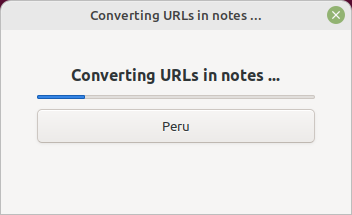

# Convert NARC URLs

Muuntaa Gramps-kannassa olevia Kansallisarkiston digitaaliarkiston kuvien url-osoitteita Astia-osoitteiksi:

    http://digi.narc.fi/digi/view.ka?kuid=nnnnnnnn -> https://astia.narc.fi/uusiastia/viewer/?fileId=xxxxxxxxx&aineistoId=yyyyyyyyyyy

Käyttää Kansallisarkiston muunnospalvelua, joka ei valitettavasti toimi kaikille osoitteille.

Vaikuttaa lisätiedoissa oleviin sekä henkilöiden Internet-välilehdellä oleviin osoitteisiin.

Ota ensin varmuuskopio. Käynnistä Isotammi-valikosta. Muunnos käynnistyy välittömästi, sen voi keskeyttää Peru-painikkeella. Tehdyt muutokset voi peruuttaa Muokkaa > Peru -toiminnolla.

