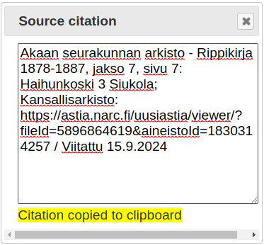

Generatecitations
-----------------
Author: kari.kujansuu@gmail.com

Generate citations from notes of a specific format. Supports certain Finnish digital archives.

### National Archives (Kansallisarkisto/Astia) 

The tool supports the citations generated by Digihakemisto (https://en.digihakemisto.net/), not the citations from Astia itself!

For example, if you click the "citation" link at this page (top right corner)

https://en.digihakemisto.net/item/1830314257/5896864619/7

you will get this citation string displayed in a dialog:

Akaan seurakunnan arkisto - Rippikirja 1878-1887, jakso 7, sivu 7: Haihunkoski 3 Siukola; Kansallisarkisto: https://astia.narc.fi/uusiastia/viewer/?fileId=5896864619&aineistoId=1830314257 / Viitattu 15.9.2024

Then for an event in Gramps, you can create a Note and paste the string above as the content of the note.

Then run this tool. It will run for a while and display a summary like

The event now has a citation:

The citation contains:

* Volume/Page = jakso 7, sivu 7: Haihunkoski 3 Siukola
* Source = Akaan seurakunnan rippikirja 1878-1887
* Repository = Akaan seurakunnan arkisto

and the citation has a note with the text

    Kansallisarkisto: https://astia.narc.fi/uusiastia/viewer/?fileId=5896864619&aineistoId=1830314257 / Viitattu 15.9.2024

The tool deletes the original note.

### Finland's Family History Association (FFHA, SSHY) 

Similarly, for this page at Finland's Family History Association (FFHA, SSHY) site

https://www.sukuhistoria.fi/sshy/sivut_eng/jasenille/paikat.php?bid=25347&pnum=10

you can click the "Viite" link at the top. You will get the citation

    Akaa Communion Book 1878-1887 (AP I Aa:15)  Sivu 7 Haihunkoski, Siukola ; SSHY http://www.sukuhistoria.fi/sshy/sivut_eng/jasenille/paikat.php?bid=25347&pnum=10 / Viitattu 15.09.2024

Copy that text and in a similar way you can create a citation in Gramps that contains:

* Volume/Page = Sivu 7 Haihunkoski, Siukola
* Source = Akaa Communion Book 1878-1887 (AP I Aa:15)
* Repository = Akaa Communion  (this should actually be just "Akaa" - there is a defect in the tool)

and the citation has a note with the text

    SSHY: http://www.sukuhistoria.fi/sshy/sivut_eng/jasenille/paikat.php?bid=25347&pnum=10 / Viitattu 15.09.2024
    
    
### Notes

The format of the original note should be exactly like it is obtained from Digihakemisto or FFHA.

You can add several notes and then run the tool. The tool will process all notes that are in a supported format.

The tool will not create a new source or repository if they already exist. That is, it tries to avoid duplicates.

The tool supports also the Swedish National Archive's and the Finnish National Library's digital archives.

You should close all editor windows before running the tool.
