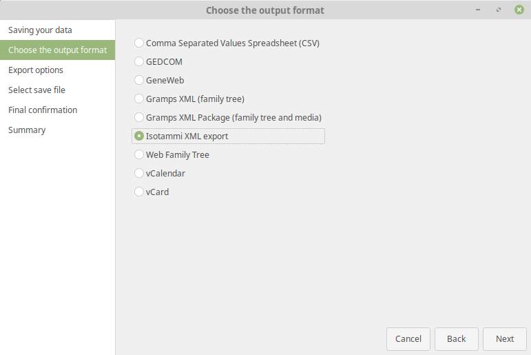
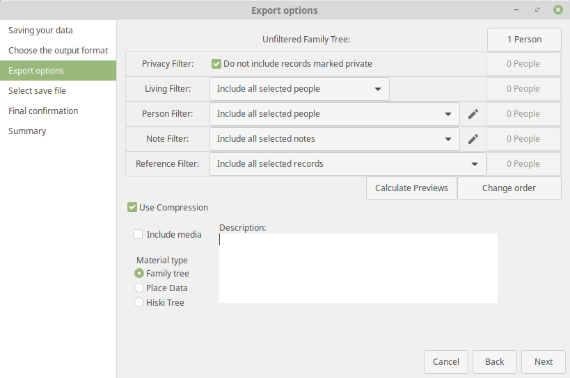

IsotammiExportXML
------------------
Author: kari.kujansuu@gmail.com
18 May 2021

Gramps export add-on that produces an XML file with some additional metadata. The metadata will be utilized by the Isotammi application.

### Installation

Install the add-on either manually (https://gramps-project.org/wiki/index.php/5.1_Addons#Manually_installed_Addons) or using the instructions here: https://github.com/Taapeli/isotammi-addons

### Usage

Select Export from the Gramps menu (Family Trees > Export). Select "Isotammi XML Export" from the list:

On the next screen you can choose, in addition of the standard options:

* whether or not include media in the file
* what is the type of the material
* any free form description

These settings will be saved in the XML file. See below for details.

### File format

The resulting file has the default extension ".isotammi.gpkg" (yes, it is a "double extension"). The file format is the same as in Gramps .gpkg files. Even when you don't include the media - in that case the media is simply not included but the file is still a gpkg file. The file format is compatible with Gramps - i.e. Gramps can still read the file normally and it will ignore the new metadata. 

Using the extension .isotammi.gpkg is not mandatory - you can use plain .gpkg but including "isotammi" will make it clearer that it contains Isotammi metadata.

Referring to the file as an "XML file" is actually a bit misleading. Actually it is a gzipped tar file with an embedded XML file.

### Include media

This causes the export to include any media files - just as the regular .gpkg export in Gramps. If the media is not included, the file will still be in gpkg format as described above.

### Material type

There is a choice of three types defined by the Isotammi project:

* Family Tree 
  * a regular family tree

* Place Data
  * a database containing only place data

* Hiski Tree
  * a family tree containing data from the Hiski database

### Description

This is a free form description of the database/family tree. It will be stored in the XML file and displayed by the Isotammi application.
