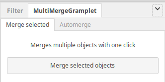
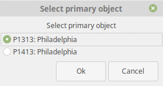

MultiMergeGramplet
------------------
Author: kari.kujansuu@gmail.com
7 Jun 2020

Gramplet to merge multiple objects in one step. This applies to

- people
- families
- places
- sources
- repositories
- notes

Install the gramplet in the corresponding view (people, families etc). Then select the objects to be merged and click the button "Merge selected objects". 

The gramplet will ask which of the selected objects should be the primary object.

The gramplet executes the standard merge function pairwise for the selected objects. The user can select the primary object but otherwise the merges are performed using the defaults for each case.

There is special handling for families and notes:

Two families cannot be merged if the primary family is missing a parent but the other family has the corresponding parent. The gramplet checks for this situation and does not allow selecting such family as the primary family. If there is no suitable primary family among the selected families then the gramplet issues the error "Impossible to merge" and stops.

By default, when merging notes only the text of the primary note is preserved. This gramplet allows saving text from all merged notes by appending the text after the text of the primary note.

All changes are done under a transaction and they can be undone from the Gramps menu 

This gramplet works in the Gramps versions 5.x

