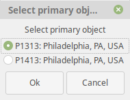
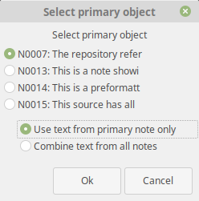
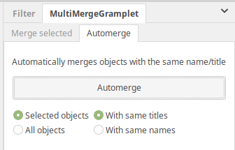
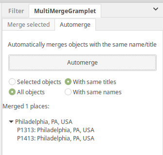

MultiMergeGramplet
------------------
Author: kari.kujansuu@gmail.com
7 Jun 2020 (updated 29 April 2021)

Gramplet to merge multiple objects in one step. This applies to

- people
- families
- places
- sources
- repositories
- notes

### Installation

Install the add-on either manually (https://gramps-project.org/wiki/index.php/5.1_Addons#Manually_installed_Addons) or using the instructions here: https://github.com/Taapeli/isotammi-addons

Use the Gramps user interface to add the gramplet in the sidebar or bottombar of the corresponding view (people, families etc). 

This gramplet works in the Gramps versions 5.x

### Usage

Select the objects to be merged and click the button "Merge selected objects". 

The gramplet will ask which of the selected objects should be the primary object.

The gramplet executes the standard merge function pairwise for the selected objects. The user can select the primary object but otherwise the merges are performed using the defaults for each case.

All changes are done under a single transaction and they can be undone from the Gramps menu (Edit > Undo) or with Ctrl-Z.

### Special handling for families 

Two families cannot be merged if the primary family is missing a parent but the other family has the corresponding parent. The gramplet checks for this situation and does not allow selecting such family as the primary family. If there is no suitable primary family among the selected families then the gramplet issues the error "Impossible to merge" and stops.

### Special handling for notes:

By default, when merging notes only the text of the primary note is preserved. This gramplet allows saving text from all merged notes by appending the text after the text of the primary note:

### Automerge

There is also an "Automerge" feature for places, sources and repositories. This is placed on its own tab:

This will automatically merge all objects with the same name (or title for source and places). This affects either only the selected objects or all objects. After the operation a list of merged objects will be displayed. An example after using automerge for places:

