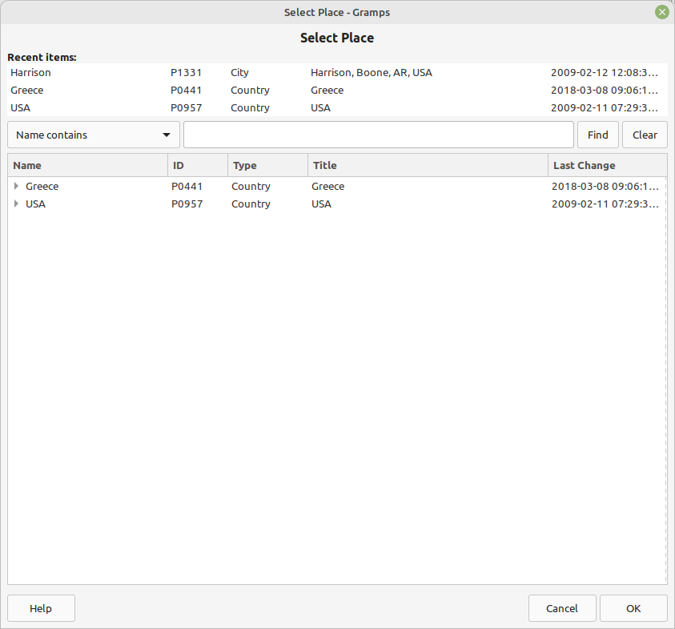
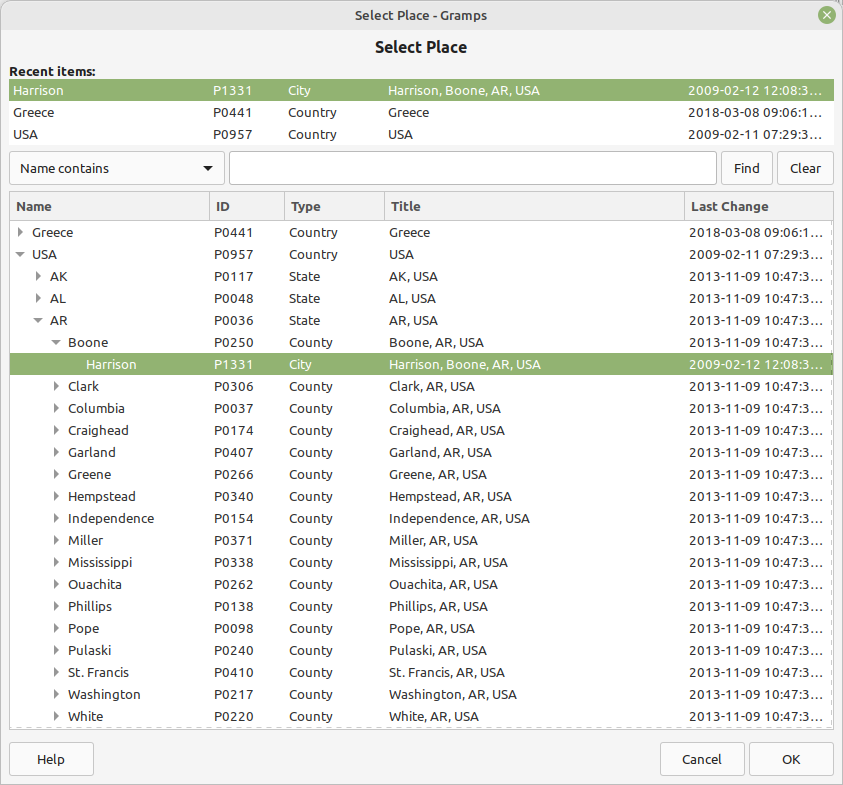

# Recent items
v0.9.4 
30 Mar 2025 
Author: kari.kujansuu@gmail.com 

Update on March, 30, 2025: this should now support Gramps 6.0.

This is an experiment to add recently used items to the various selector dialogs in Gramps. See for example the discussion
https://gramps.discourse.group/t/add-a-recent-sub-menu/5760.

This is an addon that works by patching some Gramps internal objects. So this is more like a proof-of-concept, not a final solution. However, with an
addon it is easy to experiment with various Gramps versions.

After this addon in installed and Gramps restarted any used objects will be saved and displayed in the selector dialogs. For example, in the Place selection dialog one can see at most the six last used places at the top of the dialog:

These items can be selected normally, e.g. by double clicking. A single click will reveal the place in the main list below:

