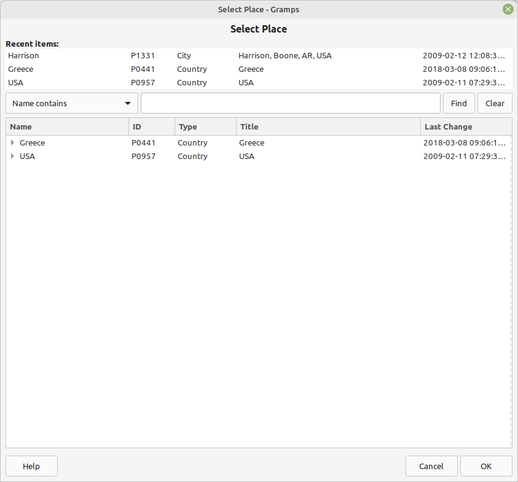
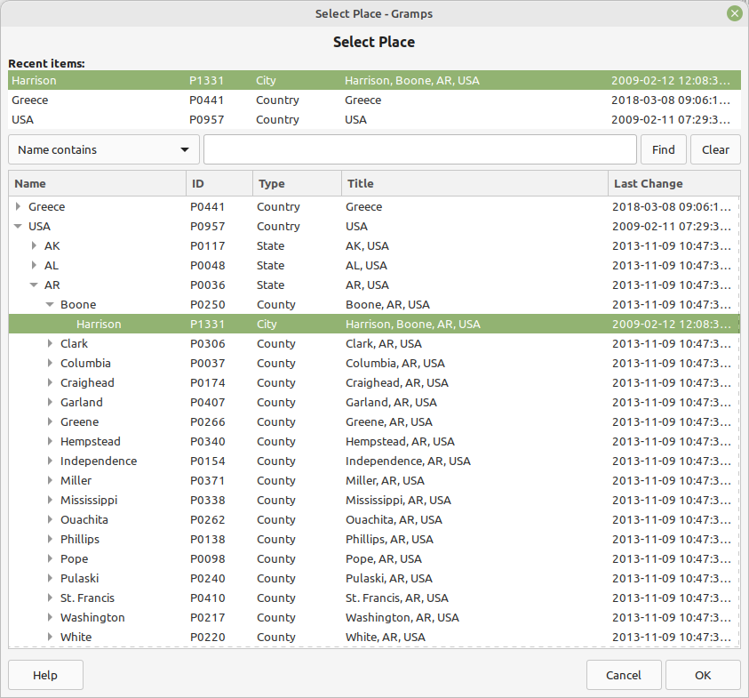

# Recent items

v0.10.1 
7 Jul 2026 
Author: kari.kujansuu@gmail.com 

This addon adds recently used items to the various selector dialogs in Gramps.

This is an experiment to add recently used items to the various selector dialogs in Gramps. See for example the discussion
https://gramps.discourse.group/t/add-a-recent-sub-menu/5760.

This addon works by patching some Gramps internal objects. So this is more like a proof-of-concept, not a final solution. However, with an addon it is easy to experiment with various Gramps versions.

After this addon is installed and Gramps is restarted, any used objects will be saved and displayed in the selector dialogs. For example, in the Place selection dialog one can see at most the ten last used places at the top of the dialog.

The space allocated for the recent-items is preset to 100 pixels in the original version. Changing the value for the `sw.set_min_content_height` setting will change this. Doubling that value to 200 pixels may be more comfortable for scrolling.

These items can be selected normally, e.g. by double clicking. A single click will reveal the place in the main list below:

